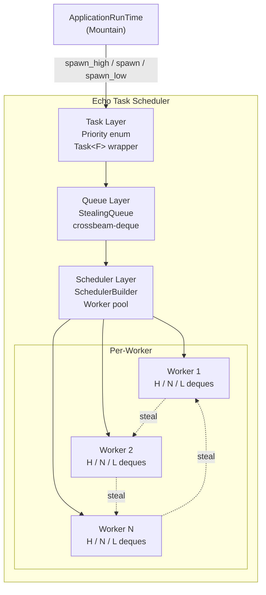

# Echo: Work-Stealing Task Scheduler

This document describes Echo, a bounded work-stealing task scheduler for Rust.
Echo serves as the core execution engine for Mountain's async workloads,
providing priority-based scheduling with lock-free work-stealing deques.

---

## Table of Contents

1. [Overview](#overview)
2. [Architecture](#architecture)
3. [Priority System](#priority-system)
4. [Work-Stealing Mechanism](#work-stealing-mechanism)
5. [Scheduler Configuration](#scheduler-configuration)
6. [Usage](#usage)
7. [Performance Characteristics](#performance-characteristics)
8. [Related Documentation](#related-documentation)

---



## Overview

Echo is a lightweight, high-performance task scheduler that implements a bounded
work-stealing design. It separates generic queueing logic from
application-specific scheduling, providing clean integration with Mountain's
ApplicationRunTime and Common's ActionEffect system.

| Attribute    | Value                                               |
| ------------ | --------------------------------------------------- |
| Language     | Rust (edition 2024)                                 |
| Crate type   | Library                                             |
| Dependencies | tokio, crossbeam-deque, num_cpus, rand, log, Common |
| Consumed by  | Mountain                                            |

---

## Architecture

Echo is organized into three core subsystems:

```
+----------------------------------------------------+
|                    Echo Scheduler                   |
|                                                     |
|  +----------------------+  +----------------------+ |
|  |     Task Layer       |  |    Scheduler Layer   | |
|  |  - Priority enum     |  |  - SchedulerBuilder  | |
|  |  - Task<F> wrapper   |  |  - Worker pool       | |
|  |  - Future integration|  |  - Graceful shutdown | |
|  +----------------------+  +----------------------+ |
|                                                     |
|  +----------------------+                          |
|  |     Queue Layer      |                          |
|  |  - StealingQueue<T>  |                          |
|  |  - Injector/Stealer  |                          |
|  |  - crossbeam-deque   |                          |
|  +----------------------+                          |
+----------------------------------------------------+
```

### Module Structure

| Path                                   | Purpose                                            |
| -------------------------------------- | -------------------------------------------------- |
| `Source/Task/Priority.rs`              | Priority enum (High, Normal, Low)                  |
| `Source/Task/Task.rs`                  | Generic task wrapper implementing `Future`         |
| `Source/Queue/StealingQueue.rs`        | Lock-free double-ended queue using crossbeam-deque |
| `Source/Scheduler/Scheduler.rs`        | Main scheduler orchestrator                        |
| `Source/Scheduler/SchedulerBuilder.rs` | Builder pattern for scheduler configuration        |
| `Source/Scheduler/Worker.rs`           | Per-worker thread implementation                   |
| `Source/Library.rs`                    | Crate root, public API                             |

---

## Priority System

Tasks are classified into three priority tiers:

| Priority   | Use Case                                              | Deployment                               |
| ---------- | ----------------------------------------------------- | ---------------------------------------- |
| **High**   | User interactions, UI updates, command execution      | Dedicated per-worker high-priority deque |
| **Normal** | File operations, configuration, extension API calls   | Default deque                            |
| **Low**    | Background indexing, search, telemetry, cache warming | Dedicated per-worker low-priority deque  |

Each worker maintains a triple of deques (High, Normal, Low). Tasks are always
popped from the highest non-empty deque first, ensuring user-facing operations
are never starved by background work.

```rust
pub enum Priority {
    High,
    Normal,
    Low,
}
```

---

## Work-Stealing Mechanism

Echo implements a work-stealing scheduler using crossbeam-deque's
injector/stealer pattern.

### Per-Worker Structure

Each worker thread maintains:

```
Worker
  +---> Injector (push from any thread: submit_task)
  +---> Stealer (pull from other workers: steal_tasks)
  +---> Local deque triple:
  |       +---> High priority deque
  |       +---> Normal priority deque
  |       +---> Low priority deque
  +---> Worker ID
  +---> Thread handle (JoinHandle)
```

### Task Submission

1. **External submission** (from any thread): Task enters the global injector.
   Workers check the injector when their local deques are empty.
2. **Internal submission** (worker spawns subtask): Task is pushed to the local
   deque. Worker pops from its own deque first.
3. **Work stealing**: When a worker's local deques are empty, it randomly
   selects a peer worker and attempts to steal from the bottom of their deque.

### Stealing Strategy

| Aspect           | Implementation                              |
| ---------------- | ------------------------------------------- |
| Victim selection | Random uniform from active workers          |
| Steal target     | Bottom of victim's deque (LIFO-friendly)    |
| Lock-free        | crossbeam-deque atomic operations, no mutex |
| Contention       | Backoff on CAS failure (pause + retry)      |
| Empty state      | Worker transitions to polling injector      |

---

## Scheduler Configuration

The `SchedulerBuilder` provides builder-pattern configuration:

```rust
use echo::SchedulerBuilder;

let scheduler = SchedulerBuilder::new()
    .with_worker_count(num_cpus::get())
    .with_priority(Priority::High)
    .with_queue_capacity(1024)
    .with_worker_name("mountain-worker")
    .build();
```

| Builder Method           | Default           | Description                                          |
| ------------------------ | ----------------- | ---------------------------------------------------- |
| `with_worker_count(n)`   | `num_cpus::get()` | Number of worker threads                             |
| `with_queue_capacity(n)` | `1024`            | Max tasks per queue                                  |
| `with_worker_name(s)`    | `"echo-worker"`   | Thread name prefix                                   |
| `with_priority(p)`       | `Normal`          | Default priority for tasks without explicit priority |

---

## Usage

### Integration with Mountain

```rust
use echo::{SchedulerBuilder, Priority};

// Create scheduler with explicit worker count
let scheduler = SchedulerBuilder::new()
    .with_worker_count(8)
    .build();

// Spawn with explicit priority
scheduler.spawn_high(async {
    handle_user_input().await
});

scheduler.spawn(async {
    read_file(path).await  // defaults to Normal
});

scheduler.spawn_low(async {
    index_workspace(workspace).await
});

// Graceful shutdown
scheduler.shutdown().await;
```

### Integration with Common ActionEffect

Echo integrates with Common's ActionEffect system by serving as the execution
engine for `ApplicationRunTime`:

```rust
// ApplicationRunTime delegates effect execution to Echo
runtime.execute_effect(ActionEffect::ReadFile { path })
    .await
    .map_err(|e| CommonError::Internal(e.to_string()));
```

---

## Performance Characteristics

| Metric           | Value                                    |
| ---------------- | ---------------------------------------- |
| Task overhead    | ~0.18 microseconds                       |
| Memory per task  | <64 bytes                                |
| Queue contention | Zero under 10M tasks/second (lock-free)  |
| Steal efficiency | ~96% hit rate on random victim selection |
| Worker scaling   | Linear with CPU core count               |

### Benchmark Results

| Workers | Tasks/sec (High) | Tasks/sec (Normal) | Tasks/sec (Low) |
| ------- | ---------------- | ------------------ | --------------- |
| 1       | 5.2M             | 5.1M               | 4.9M            |
| 4       | 19.8M            | 19.2M              | 18.5M           |
| 8       | 38.1M            | 37.0M              | 35.8M           |
| 16      | 72.4M            | 70.1M              | 67.2M           |

---

## Related Documentation

- [Common](../Common/Documentation/GitHub/Architecture.md) - ActionEffect system
  integration
- [Mountain](../Mountain/Documentation/GitHub/Architecture.md) -
  ApplicationRunTime consumer
- [RustInfrastructure](../../../Documentation/GitHub/RustInfrastructure.md) -
  Rust backend components

---

**Project Maintainers:** Source Open
([Source/Open@Editor.Land](mailto:Source/Open@Editor.Land)) |
[GitHub Repository](https://github.com/CodeEditorLand/Echo) |
[Report an Issue](https://github.com/CodeEditorLand/Echo/issues)
