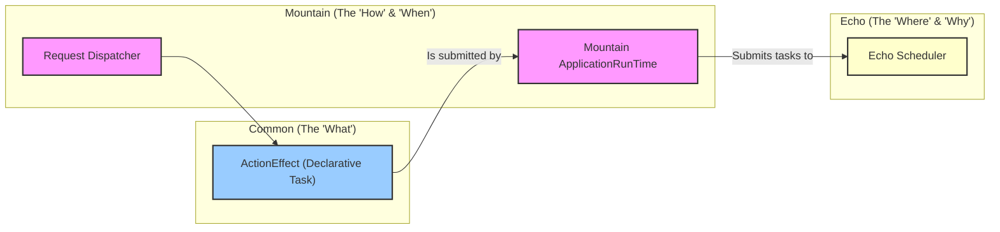

<table><tr>
<td colspan="1"> <h3 align="center"> <picture>
<source media="(prefers-color-scheme: dark)" srcset="https://PlayForm.Cloud/Dark/Image/GitHub/Land.svg">
<source media="(prefers-color-scheme: light)" srcset="https://PlayForm.Cloud/Image/GitHub/Land.svg">

</picture> </h3> </td> <td colspan="3" valign="top"> <h3 align="center"> Echo 📣
</h3> </td>
</tr></table>

---

# **Echo** 📣 Deep Dive & Architecture

This document provides a detailed technical overview of the **Echo** project for
developers. It explores the internal architecture, core components, and the
design patterns used to create a high-performance, structured concurrency
runtime.

## Core Architecture Principles

| Principle                  | Description                                                                                                                                                    | Key Components Involved                                             |
| :------------------------- | :------------------------------------------------------------------------------------------------------------------------------------------------------------- | :------------------------------------------------------------------ |
| **Performance**            | Use lock-free data structures (`crossbeam-deque`) and a high-performance work-stealing algorithm to achieve maximum throughput and low-latency task execution. | `Queue::StealingQueue`, `Scheduler::Worker`                         |
| **Structured Concurrency** | Manage all asynchronous operations within a supervised pool of workers, providing graceful startup and shutdown, unlike fire-and-forget `tokio::spawn`.        | `Scheduler::Scheduler`, `Scheduler::SchedulerBuilder`               |
| **Decoupling**             | Separate the generic **Queueing Logic** from the application-specific **Scheduler Implementation**. The scheduler uses the queue to run its tasks.             | `Queue::StealingQueue<TTask>`, `Scheduler::Scheduler`, `Task::Task` |
| **Resilience**             | The scheduler's design is inherently resilient; a panic in one task is contained within its `tokio` task and does not crash the entire worker pool.            | `Scheduler::Worker::Run`                                            |
| **Composability**          | Provide a simple `Submit` API that accepts any `Future<Output = ()>`, making it easy to integrate with any asynchronous Rust code.                             | `Task::Task`, `Scheduler::Scheduler::Submit`                        |
| **Prioritization**         | Allow tasks to be submitted with different priorities to ensure that latency-sensitive work is executed before background work.                                | `Task::Priority`, `Queue::StealingQueue::Priority`                  |

---

## Deep Dive into `Echo`'s Components

The architecture of `Echo` is cleanly separated into three distinct modules:
`Task`, `Queue`, and `Scheduler`.

### 1. The `Task` Module (`Source/Task/`)

- **Role:** Defines what a "task" is for the `Echo` scheduler. It's the concrete
  unit of work.
- **`Task::Priority`:** Defines the `enum Priority` (`High`, `Normal`, `Low`).
  This is the priority system used by the application logic.
- **`Task::Task`:** Defines `pub struct Task`, which contains:
    - `Operation: Pin<Box<dyn Future<Output = ()> + Send>>`: The actual
      asynchronous operation to be executed. By boxing the future, we can store
      different kinds of futures in the same queue (type erasure).
    - `Priority: Priority`: The priority level of the task.
- **Trait Implementation:** It implements the
  `Queue::StealingQueue::Prioritized` trait, which acts as a bridge, allowing
  the `Task` to be used by the generic `Queue`.

### 2. The `Queue` Module (`Source/Queue/`)

- **Role:** This module is a **generic, reusable, priority-aware work-stealing
  library**. It knows nothing about `Echo`'s specific `Task` type; it can
  schedule _any_ type `TTask` that implements the `Prioritized` trait.
- **`StealingQueue.rs`:**
    - **`trait Prioritized`:** A public contract that any schedulable item must
      fulfill.
    - **`struct StealingQueue<TTask>`:** The public-facing queue. Its `Create`
      method is the key to its design. It initializes all the internal data
      structures and returns two things:
        1.  An instance of itself, which is used to `Submit` new tasks.
        2.  A `Vec<Context<TTask>>`, containing one unique context object for
            each worker thread.
    - **`struct Context<TTask>`:** A critical data structure that bundles
      together everything one worker needs to operate. Most importantly, it
      takes **ownership** of the thread-local `crossbeam_deque::Worker` queues,
      which are **not safe to share**. This ownership design is what makes the
      entire system thread-safe.

### 3. The `Scheduler` Module (`Source/Scheduler/`)

- **Role:** This module is the **application-specific consumer** of the generic
  `Queue` library. It ties everything together to create the final,
  public-facing `Echo` scheduler.
- **Component Breakdown:**
    - **`SchedulerBuilder.rs`:** A fluent API for configuring the scheduler
      (e.g., `WithWorkerCount`).
    - **`Worker.rs`:** A thin, private wrapper that holds a
      `Queue::Context<Task>`. Its `Run(self)` method contains the
      high-performance work-finding loop:
        1.  First, attempt to `PopLocal()` from its own deques.
        2.  Only if local queues are empty, attempt to `StealFromSystem()`.
        3.  If no work is found anywhere, sleep briefly to yield the CPU.
    - **`Scheduler.rs`:**
        - **`Create()`:** This method, called by the builder, instantiates the
          generic queue for the specific `Task` type:
          `StealingQueue::<Task>::Create()`. It then spawns the configured
          number of `Worker`s onto `tokio` threads, giving each one its unique
          `Context`.
        - **`Submit()`:** The primary public method. It takes a future and a
          priority, wraps them in a `Task`, and calls the underlying
          `Queue.Submit()` method.
        - **`Stop()`:** A graceful shutdown mechanism that signals all workers
          to terminate their loops and awaits their `JoinHandle`s.

---

## End-to-End Workflow Example: Submitting an Effect

This demonstrates how `Mountain`'s `ApplicationRunTime` uses `Echo` to run a
`Common::ActionEffect`:

1.  **Application Call (`Mountain`):** Logic creates an `ActionEffect` and calls
    `RunTime.Run(Effect)`.
2.  **Runtime (`Mountain`):** The `Run` method receives the `ActionEffect`. a.
    It creates a `tokio::sync::oneshot` channel to get the result back. b. It
    creates a new `Future` that will: i. Call the `ActionEffect`'s `Apply`
    method with the required capability. ii. Take the `Result<TOutput, TError>`
    from the effect. iii. Send this result through the `oneshot` sender.
3.  **Scheduler (`Echo`):** The `ApplicationRunTime` calls `Scheduler.Submit()`
    with the new `Future` and a priority. a. `Scheduler.Submit` creates a
    `Task`. b. It calls `Queue.Submit()`, which pushes the `Task` onto the
    appropriate global `Injector` queue.
4.  **Worker (`Echo`):** An idle `Worker` in its `Run` loop finds the new task
    by checking its local queue or stealing from the global queue.
5.  **Execution:** The `Worker` `await`s the `Task.Operation`. This executes the
    logic from step 2b, which in turn `await`s the original `ActionEffect`.
6.  **Result Propagation:** The `ActionEffect` completes. Its `Result` is sent
    through the `oneshot` channel.
7.  **Unwinding (`Mountain`):** The original `Run` method, which was `await`ing
    the `oneshot` receiver, wakes up with the result and returns it to the
    application.

This demonstrates a clean, decoupled flow where `Mountain` describes the work,
and `Echo` handles the complex details of how, when, and where to execute it
efficiently.

---

## Project Structure Overview

The `Echo` repository is organized into a few core modules with a clear
separation of concerns:

```
Echo/
└── Source/
    ├── Library.rs               # Crate root, declares all modules.
    ├── Scheduler/               # The main public API: Scheduler and Builder. Consumes the Queue.
    ├── Queue/                   # The generic, high-performance work-stealing queue library.
    └── Task/                    # The application-specific definition of a Task and its Priority.
```

---

## How `Echo` Fits into the `Land` Ecosystem

`Echo` is the foundational execution engine inside `Mountain`, ensuring that all
application logic runs efficiently and concurrently.


