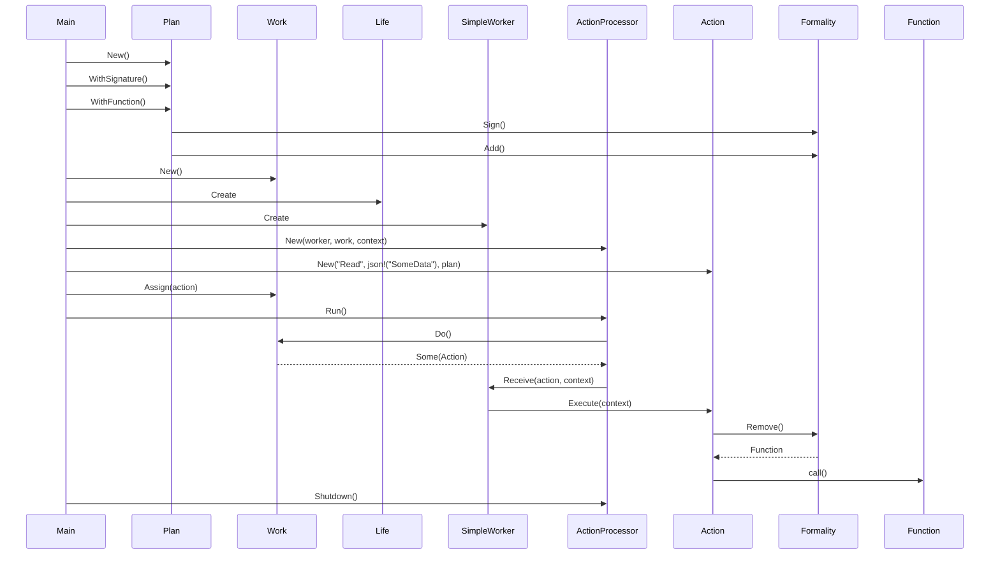

# 📣 [Echo] — Asynchronous Action Processing System

`Echo` is a Rust library designed for managing and executing asynchronous actions efficiently. It leverages a worker-stealer pattern and asynchronous queues to handle complex workflows with features like metadata management, function planning, and robust error handling.

## Table of Contents

-   [Introduction](#Introduction)
-   [Features](#Features)
-   [Installation](#Installation)
-   [Usage](#Usage)
-   [Architecture](#Architecture)
-   [Contributing](CONTRIBUTING.md)
-   [License](LICENSE)

## Introduction

`Echo` provides a robust framework for defining, queuing, and executing actions
asynchronously. It's designed to handle complex workflows with features like
metadata management, function planning, and error handling.

## Features

- **Asynchronous Operations:** Built with Rust's async/await syntax for non-blocking execution.
- **Action Planning:** Define and execute actions with custom logic using a flexible plan system.
- **Metadata Management:** Attach metadata to actions for additional context and control.
- **Error Handling:** Comprehensive error management with custom `ActionError` types.
- **Retry Mechanism:** Built-in retry logic for failed actions with exponential backoff.
- **Hooks:** Supports pre and post-execution hooks for added flexibility.
- **Serialization:** Actions can be serialized and deserialized for persistence or network transfer (in progress).

## Installation

To get started with `Echo`, follow these steps:

1. **Add to your Cargo.toml**:

```toml
[dependencies]
Echo = { git = "HTTPS://GitHub.Com/CodeEditorLand/Echo.git" }
```

2. **Build the Project**:

```bash
cargo build
```

## Usage

Here's a basic example demonstrating how to define and execute an action:

```rust
use Echo::Sequence::{
    Action::{Error::Enum as ActionError, Struct as Action, Trait as ActionTrait},
    Life::Struct as Life,
    Plan::{Formality::Struct as Formality, Struct as Plan},
    Production::Struct as Work,
    Site::Trait as Worker,
    Struct as ActionProcessor,
};
use serde_json::json;
use std::sync::Arc;
use tokio::sync::Mutex;

#[tokio::main]
async fn main() -> Result<(), Box<dyn std::error::Error>> {
    // Define the action's logic
    let read_function = |_args: Vec<serde_json::Value>| async move {
        // Access the provided path (replace with actual logic)
        let path = "path/to/file.txt"; 

        // Simulate reading from the path
        let content = format!("Content read from: {}", path);

        Ok(json!(content))
    };

    // Create an action plan
    let plan = Plan::New()
        .WithSignature(Echo::Struct::Sequence::Action::Signature::Struct {
            Name: "Read".to_string(),
        })
        .WithFunction("Read", read_function)?
        .Build();

    // Create a work queue
    let work = Arc::new(Work::New());

    // Create a lifecycle context (replace with your actual configuration)
    let context = Life::Struct {
        Span: Arc::new(dashmap::DashMap::new()),
        Fate: Arc::new(config::Config::default()),
        Cache: Arc::new(Mutex::new(dashmap::DashMap::new())),
        Karma: Arc::new(dashmap::DashMap::new()),
    };

    // Define a worker to execute actions
    struct SimpleWorker;

    #[async_trait::async_trait]
    impl Worker for SimpleWorker {
        async fn Receive(
            &self,
            action: Box<dyn ActionTrait>,
            context: &Life,
        ) -> Result<(), ActionError> {
            action.Execute(context).await
        }
    }
    let worker = Arc::new(SimpleWorker);

    // Create an action processor
    let processor = Arc::new(ActionProcessor::New(worker, work.clone(), context));

    // Create an action and add it to the queue
    let action = Action::New(
        "Read",
        json!("SomeData"), 
        Arc::clone(&plan),
    );
    work.Assign(Box::new(action)).await;

    // Run the processor
    processor.Run().await;

    Ok(())
}
```

## Architecture

### Core Components

- **Action:** Represents a unit of work with associated metadata, content, and execution logic.
- **Plan:** Defines the structure and functions for different action types.
- **Work:** A thread-safe queue for managing pending actions.
- **Worker:** Implements the logic for receiving and executing actions from the queue.
- **ActionProcessor:** Orchestrates the execution of actions using workers and the work queue.
- **Life:** Provides a shared context and configuration for actions during execution.

### Diagrams

#### Class Diagram

```mermaid
classDiagram
    class ActionError {
        <<enumeration>>
        +License(String)
        +Execution(String)
        +Routing(String)
        +Cancellation(String)
    }

    class ActionSignature {
        +Name: String
    }

    class Action~T~ {
        +Metadata: Vector
        +Content: T
        +License: Signal<bool>
        +Plan: Arc<Formality>
        +New(Action: &str, Content: T, Plan: Arc<Formality>)
        +WithMetadata(Key: &str, Value: serde_json::Value)
        +Execute(Context: &Life) Result<(), Error>
    }

    class Life {
        +Span: Arc<DashMap<String, Cycle::Type>>
        +Fate: Arc<Config>
        +Cache: Arc<Mutex<DashMap<String, serde_json::Value>>>
        +Karma: Arc<DashMap<String, Arc<Production>>>
    }

    class Formality {
        +Signature: DashMap<String, ActionSignature>
        +Function: DashMap<String, Box<dyn Fn(Vec<Value>) -> Pin<Box<dyn Future<Output = Result<Value, Error>> + Send>> + Send + Sync>
        +New()
        +Sign(Signature: ActionSignature)
        +Add(Name: &str, Function: F) Result<&mut Self, String>
        +Remove(Name: &str) Option<Box<dyn Fn(Vec<Value>) -> Pin<Box<dyn Future<Output = Result<Value, Error>> + Send>> + Send + Sync>
    }

    class Plan {
        +Formality: Formality
        +New()
        +WithSignature(Signature: ActionSignature)
        +WithFunction(Name: &str, Function: F) Result<Self, String>
        +Build() Formality
    }

    class Work {
        +Line: Arc<Mutex<VecDeque<Box<dyn ActionTrait>>>>
        +New()
        +Do() Option<Box<dyn ActionTrait>>
        +Assign(Action: Box<dyn ActionTrait>)
    }

    class Signal~T~ {
        +0: Arc<Mutex<T>>
        +New(Value: T)
        +Get() T
        +Set(To: T)
    }

    class Vector {
        +Entry: DashMap<String, serde_json::Value>
        +New()
        +Insert(Key: String, Value: serde_json::Value)
        +Get(Key: &str) Option<serde_json::Value>
    }

    class ActionProcessor {
        +Site: Arc<dyn Site>
        +Production: Arc<Work>
        +Life: Life
        +Time: Signal<bool>
        +New(Site: Arc<dyn Site>, Production: Arc<Work>, Life: Life)
        +Run()
        +Again(Action: Box<dyn ActionTrait>) Result<(), ActionError>
        +Shutdown()
    }

    class SimpleWorker {
        <<Example>>
        +Receive(action: Box<dyn ActionTrait>, context: &Life) Result<(), ActionError>
    }

    Action~T~ --|> ActionTrait
    SimpleWorker ..|> Site
    ActionProcessor o-- Site
    ActionProcessor o-- Work
    ActionProcessor o-- Life
    Action~T~ o-- Formality
    Formality o-- ActionSignature
    Plan o-- Formality
    Work o-- ActionTrait
    ActionProcessor o-- Signal~T~
    Action~T~ o-- Vector
    Life o-- Cycle::Type
    Life o-- Production
```

#### Sequence Diagram



## Contributing

Contributions are welcome! Please see [CONTRIBUTING.md](CONTRIBUTING.md) for guidelines.

## License

This project is licensed under the [LICENSE](LICENSE) file.

## Changelog

See [CHANGELOG.md](CHANGELOG.md) for a history of changes to this component.
