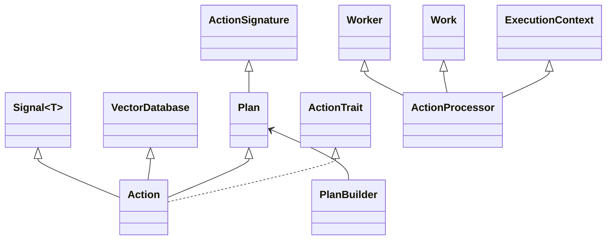

# 📣 [Echo] —

Echo is a communication library designed to facilitate file reading and writing
operations across multiple applications using WebSockets.

It implements the worker-stealer pattern and utilizes asynchronous and parallel
queues to efficiently manage tasks.

## Table of Contents

-   [Introduction](#Introduction)
-   [Features](#Features)
-   [Installation](#Installation)
-   [Usage](#Usage)
-   [Architecture](#Architecture)
-   [Contributing](CONTRIBUTING.md)
-   [License](LICENSE)

## Introduction

Echo is designed to streamline the process of reading and writing files across
different applications. By leveraging WebSockets, it ensures real-time
communication and efficient task management.

## Features

-   **Asynchronous Operations**:

Utilizes asynchronous functions to handle file operations, ensuring non-blocking
execution.

-   **WebSocket Communication**:

Facilitates real-time communication between different components of the system.

## Installation

To get started with Echo, follow these steps:

1. **Clone the Repository**:

    ```bash
    git clone ssh://git@github.com/CodeEditorLand/Echo.git
    cd Echo
    ```

2. **Build the Project**:

    ```bash
    cargo build
    ```

3. **Install Dependencies**:

    ```bash
    pnpm install
    ```

4. **Build the TypeScript project**:
    ```bash
    pnpm run prepublishOnly
    ```

## Usage

## Architecture

### WebSocket Communication

WebSockets are used to facilitate real-time communication between the Tauri
application, Sun, and River. This ensures that file operations are executed
promptly and efficiently.

### Code Structure

-   **Interface**:

Defines the structure of the response object and the main asynchronous function
for handling responses.

-   **Worker**:

Contains the implementation of the worker-stealer pattern and the task queue
management.

-   **Main**:

The entry point of the Rust binaries, responsible for reading configuration
files and setting up the environment.

[Echo]: HTTPS://GitHub.Com/CodeEditorLand/Echo



## Changelog

See [CHANGELOG.md](CHANGELOG.md) for a history of changes to this integration.
