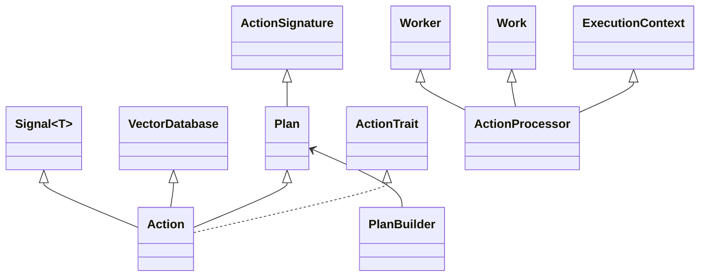
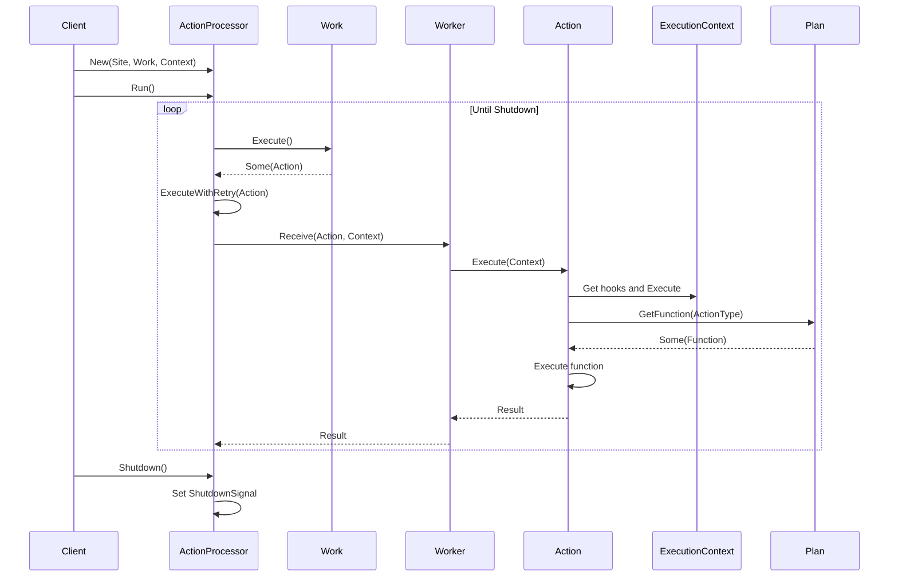
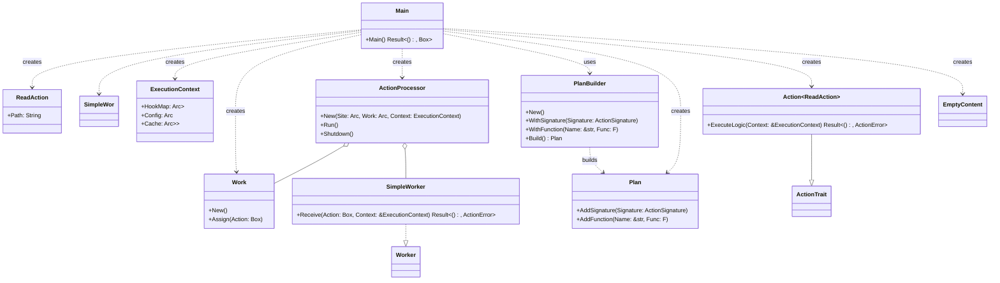
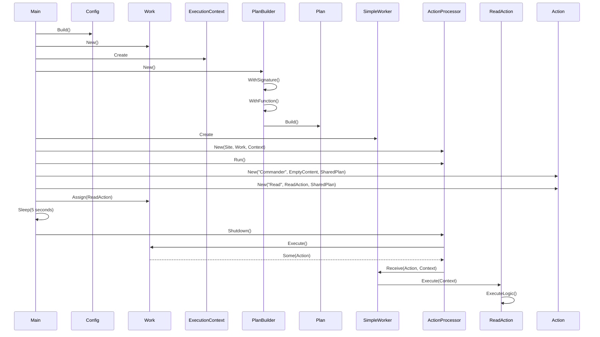

# 📣 [Echo] — Asynchronous Action Processing System

Echo is a sophisticated asynchronous action processing system designed to manage
and execute various types of actions efficiently. It implements a worker-stealer
pattern and utilizes asynchronous queues to manage tasks effectively.

## Table of Contents

-   [Introduction](#Introduction)
-   [Features](#Features)
-   [Installation](#Installation)
-   [Usage](#Usage)
-   [Architecture](#Architecture)
-   [Contributing](CONTRIBUTING.md)
-   [License](LICENSE)

## Introduction

Echo provides a robust framework for defining, queuing, and executing actions
asynchronously. It's designed to handle complex workflows with features like
metadata management, function planning, and error handling.

## Features

-   **WebSocket Communication**: Facilitates real-time communication between
    different components of the system.
-   **Asynchronous Operations**: Utilizes Rust's async/await syntax for
    non-blocking execution.
-   **Action Planning**: Flexible system for defining and executing actions with
    custom logic.
-   **Metadata Management**: Each action can carry metadata for additional
    context and control.
-   **Error Handling**: Comprehensive error handling with custom `ActionError`
    types.
-   **Retry Mechanism**: Built-in retry logic for failed actions with
    exponential backoff.
-   **Hooks**: Support for pre and post-execution hooks.
-   **Serialization**: Actions can be serialized and deserialized for
    persistence or network transfer.

## Installation

To get started with Echo, follow these steps:

1. **Add to your Cargo.toml**:

```toml
[dependencies]
Echo = { git = "HTTPS://github.com/CodeEditorLand/Echo.git" }
```

2. **Build the Project**:

```bash
cargo build
```

## Usage

Here's a basic example of how to use Echo:

```rust
use echo::{Action, ActionProcessor, ExecutionContext, Plan, PlanBuilder, Work, Worker};

#[tokio::main]
async fn main() -> Result<(), Box<dyn std::error::Error>> {
    // Create a Plan
    let Plan = PlanBuilder::New()
        .WithSignature(ActionSignature {
            Name: "Read".to_string(),
            InputTypes: vec!["String".to_string()],
            OutputType: "String".to_string(),
        })
        .WithFunction("Read", |Args| async move {
            let Path = Args[0].as_str().unwrap();
            Ok(serde_json::json!(format!("Read content from: {}", Path)))
        })?
        .Build();

    // Create a Work queue
    let Work = Arc::new(Work::New());

    // Create an ExecutionContext
    let Context = ExecutionContext::New(/* ... */);

    // Create a Worker
    struct SimpleWorker;
    #[async_trait]
    impl Worker for SimpleWorker {
        async fn Receive(&self, Action: Box<dyn ActionTrait>, Context: &ExecutionContext) -> Result<(), ActionError> {
            Action.Execute(Context).await
        }
    }
    let Worker = Arc::new(SimpleWorker);

    // Create an ActionProcessor
    let Processor = Arc::new(ActionProcessor::New(Worker, Work.clone(), Context));

    // Create and assign an Action
    let Action = Box::new(
        Action::New("Read", ReadAction { Path: "SomePath".to_string() }, Arc::new(Plan))
            .WithMetadata("Delay", serde_json::json!(1))
    );
    Work.Assign(Action).await;

    // Run the processor
    Processor.Run().await;

    Ok(())
}
```

## Architecture

### Core Components

-   **Action**: Represents a unit of work with metadata and content.
-   **Plan**: Defines the structure and execution logic for actions.
-   **Work**: Manages the queue of actions to be processed.
-   **Worker**: Implements the logic for receiving and executing actions.
-   **ActionProcessor**: Coordinates the execution of actions using Workers and
    Work queues.
-   **ExecutionContext**: Provides shared context for action execution.

### WebSocket Communication

WebSockets are used to facilitate real-time communication between the Tauri
application, [Sun](HTTPS://GitHub.com/CodeEditorLand/Sun.git), and
[River](HTTPS://GitHub.com/CodeEditorLand/River.git). This ensures that file
operations are executed promptly and efficiently.

[Echo]: HTTPS://GitHub.Com/CodeEditorLand/Echo

### Diagrams

#### Class Diagram



#### Sequence Diagram



#### [Example](./Example/Queue.rs)

#### Class Diagram



#### Sequence Diagram



## Changelog

See [CHANGELOG.md](CHANGELOG.md) for a history of changes to this component.
