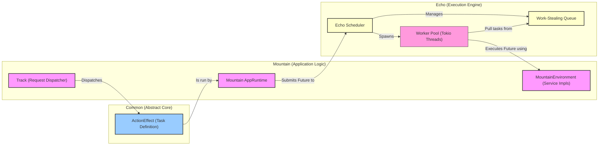

<table><tr>
<td colspan="1"> <h3 align="center"> <picture>
<source media="(prefers-color-scheme: dark)" srcset="https://PlayForm.Cloud/Dark/Image/GitHub/Land.svg">
<source media="(prefers-color-scheme: light)" srcset="https://PlayForm.Cloud/Image/GitHub/Land.svg">

</picture> </h3> </td> <td colspan="3" valign="top"> <h3 align="center"> Echo 📣
</h3> </td>
</tr></table>

---

# **Echo** 📣 A Resilient, High-Performance Task Scheduler for Rust

[](https://github.com/CodeEditorLand/Echo/tree/Current/LICENSE)
[](https://crates.io/crates/Echo)
[](https://tokio.rs/)
[](https://github.com/crossbeam-rs/crossbeam)

Welcome to **Echo**! This crate provides a powerful, structured concurrency
runtime for Rust applications, built on a high-performance **work-stealing
scheduler**. It is designed to be the core execution engine for the `Mountain`
backend, integrating seamlessly with the declarative `ActionEffect` system
defined in the `Common` crate. **Echo** moves beyond simple task spawning
(`tokio::spawn`) to provide a robust framework for managing, prioritizing, and
executing complex asynchronous workflows with resilience and efficiency.

**Echo** is engineered to:

1.  **Provide High-Performance Concurrency:** Utilizes a lock-free,
    work-stealing queue (`crossbeam-deque`) to ensure all worker threads remain
    busy, maximizing CPU utilization and application throughput.
2.  **Enable Structured Task Management:** Offers a clean API for submitting
    tasks with different priorities, allowing critical, UI-blocking operations
    to pre-empt background work.
3.  **Integrate Natively with Effect Systems:** Designed from the ground up to
    be the execution backend for systems like the `ActionEffect` pattern,
    providing a bridge between declarative task definitions and their concrete
    execution.

---

## Key Features 🔐

- **Work-Stealing Scheduler:** Implements a modern, priority-aware work-stealing
  algorithm to efficiently distribute tasks across a pool of worker threads.
- **Task Prioritization:** Supports submitting tasks with `High`, `Normal`, or
  `Low` priority, ensuring that latency-sensitive operations are handled
  immediately.
- **Fluent Builder API:** A clean `SchedulerBuilder` allows for easy
  configuration of the worker pool size.
- **Graceful Shutdown:** Provides a `Stop()` method to ensure all worker threads
  complete their current tasks and exit cleanly, preventing orphaned threads.
- **Decoupled Architecture:** A generic `Queue` module provides the core
  work-stealing logic, which is consumed by the application-specific
  `Scheduler`.

---

## Core Architecture Principles 🏗️

| Principle                  | Description                                                                                                                                                     | Key Components Involved                                               |
| :------------------------- | :-------------------------------------------------------------------------------------------------------------------------------------------------------------- | :-------------------------------------------------------------------- |
| **Performance**            | Use lock-free data structures (`crossbeam-deque`) and a high-performance work-stealing algorithm to achieve maximum throughput and low-latency task execution.  | `Queue::StealingQueue`, `Scheduler::Worker`                           |
| **Structured Concurrency** | Manage all asynchronous operations within a supervised pool of workers, providing graceful startup and shutdown, unlike fire-and-forget `tokio::spawn`.         | `Scheduler::Scheduler`, `Scheduler::SchedulerBuilder`                 |
| **Decoupling**             | Separate the generic **Queueing Logic** from the application-specific **Scheduler Implementation**. The scheduler uses the queue to run its tasks.              | `Queue::StealingQueue<T>`, `Scheduler::Scheduler`, `Task::Task::Task` |
| **Resilience**             | The scheduler's design is inherently resilient; the failure of one task (if it panics) is contained within its `tokio` task and does not crash the worker pool. | `Scheduler::Worker::Run`                                              |
| **Composability**          | Provide a simple `Submit` API that accepts any `Future<Output = ()>`, making it easy to integrate with any asynchronous Rust code.                              | `Task::Task::Task`, `Scheduler::Scheduler::Submit`                    |

---

## Deep Dive & Component Breakdown 🔬

To understand how `Echo`'s internal components interact to provide these
services, please refer to the detailed technical breakdown in
[`docs/Deep Dive.md`](docs/Deep%20Dive.md). This document explains the roles of
the `Task`, `StealingQueue`, `Worker`, and `Scheduler` in detail.

---

## `Echo` in the Land Ecosystem 📣 + 🏞️

This diagram illustrates `Echo`'s role as the core execution engine within the
`Mountain` backend.


```mermaid
graph LR
    classDef common fill:#9cf,stroke:#333,stroke-width:2px;
    classDef mountain fill:#f9f,stroke:#333,stroke-width:2px;
    classDef echo fill:#ffc,stroke:#333,stroke-width:2px;
    classDef rust fill:#f9d,stroke:#333,stroke-width:1px;

	subgraph "Common (Abstract Core)"
		ActionEffect["ActionEffect (Task Definition)"]:::common
	end

	subgraph "Mountain (Application Logic)"
        AppRuntime["Mountain AppRuntime"]:::mountain
        MountainEnv["MountainEnvironment (Service Impls)"]:::mountain
        Track["Track (Request Dispatcher)"]:::mountain
	end

	subgraph "Echo (Execution Engine)"
		Scheduler["Echo Scheduler"]:::echo
		WorkStealingQueue["Work-Stealing Queue"]:::echo
        WorkerPool["Worker Pool (Tokio Threads)"]:::rust

        Scheduler -- Manages --> WorkStealingQueue;
        Scheduler -- Spawns --> WorkerPool;
        WorkerPool -- Pull tasks from --> WorkStealingQueue;
	end

    Track -- Dispatches --> ActionEffect;
    ActionEffect -- Is run by --> AppRuntime;
    AppRuntime -- Submits Future to --> Scheduler;
    WorkerPool -- Executes Future using --> MountainEnv;
```

---

## Project Structure Overview 🗺️

The `Echo` repository is organized into a few core modules with a clear
separation of concerns:

```
Echo/
└── Source/
    ├── Library.rs               # Crate root, declares all modules.
    ├── Scheduler/               # The main public API: Scheduler and Builder. Consumes the Queue.
    ├── Queue/                   # The generic, high-performance work-stealing queue library.
    └── Task/                    # The application-specific definition of a Task and its Priority.
```

---

## Getting Started 🚀

### Installation

To add `Echo` to your project, add the following to your `Cargo.toml`:

```toml
[dependencies]
Echo = { git = "https://github.com/CodeEditorLand/Echo.git", branch = "Current" }
```

**Key Dependencies:**

- `tokio = { version = "*", features = ["full"] }`
- `crossbeam-deque = "*"`
- `rand = "*"`
- `log = "*"`
- `num_cpus = "*"`

### Usage

`Echo` is designed to be integrated into an application's main entry point and
used throughout the application, often via a shared context or runtime.

1.  **Define the Public API:** In your library's root (`lib.rs` or `main.rs`),
    re-export the primary components for easy access.

    ```rust
    // In your application's lib.rs
    pub use Echo::Scheduler::{Scheduler, SchedulerBuilder};
    pub use Echo::Task::Priority::Priority;
    ```

2.  **Initialize the Scheduler:** Create and start the scheduler when your
    application starts. It is typically wrapped in an `Arc` to be shared safely
    across your application.

    ```rust
    // In your application's main function
    use std::sync::Arc;

    // Use the fluent builder to configure and build the scheduler
    let Scheduler = Arc::new(SchedulerBuilder::Create().Count(8).Build());
    ```

3.  **Submit Tasks:** Use the `Scheduler` instance to submit asynchronous work
    from anywhere in your application.

    ```rust
    // An example async block to be run by the scheduler
    let MyTask = async {
        println!("This is running on an Echo worker thread!");
        // ... perform some work ...
    };

    // Submit the task with a desired priority
    Scheduler.Submit(MyTask, Priority::Normal);

    // Another example with high priority
    Scheduler.Submit(async { /* critical work */ }, Priority::High);
    ```

4.  **Graceful Shutdown:** Before your application exits, ensure a clean
    shutdown of all worker threads.

    ```rust
    // In your application's shutdown sequence
    // Note: Arc::get_mut requires the Arc to have only one strong reference.
    if let Some(mut Scheduler) = Arc::get_mut(&mut Scheduler) {
        Scheduler.Stop().await;
    }
    ```

---

## Help Us Boost Performance: A Call for Contributions! 🫱🏻‍🫲🏿

`Echo` is built on a high-performance foundation, but there's always room to
push the boundaries of speed and efficiency. We maintain a detailed roadmap of
features and performance optimizations, with tasks suitable for all skill
levels.

| Contribution Level | Example Tasks                                               |
| :----------------- | :---------------------------------------------------------- |
| **Quick Wins**     | Implement faster random number generation for stealing.     |
| **Architectural**  | Add a true sleep/notification system for idle workers.      |
| **Expert Tuning**  | Build a `criterion` benchmark suite; implement CPU pinning. |
| **Advanced Logic** | Introduce an anti-starvation mechanism for tasks.           |

**Interested in tackling one of these challenges?** 👉🏻

- **[Check out our full TODO](docs/TODO.md)** for challenges!
- **[Follow our Contribution Guide](CONTRIBUTING.md)** to get started!

---

## License ⚖️

This project is released into the public domain under the **Creative Commons CC0
Universal** license. You are free to use, modify, distribute, and build upon
this work for any purpose, without any restrictions. For the full legal text,
see the [`LICENSE`](LICENSE) file.

---

## Changelog 📜

Stay updated with our progress! See [`CHANGELOG.md`](CHANGELOG.md) for a history
of changes specific to **Echo**.

---

## Funding & Acknowledgements 🙏🏻

**Echo** is a core element of the **Land** ecosystem. This project is funded
through [NGI0 Commons Fund](https://nlnet.nl/commonsfund), a fund established by
[NLnet](https://nlnet.nl) with financial support from the European Commission's
[Next Generation Internet](https://ngi.eu) program. Learn more at the
[NLnet project page](https://nlnet.nl/project/Land).

| **Land**                                                                                                                                            | PlayForm                                                                                                                                                 | NLnet                                                                                      | NGI0 Commons Fund                                                                                                                                 |
| :-------------------------------------------------------------------------------------------------------------------------------------------------- | :------------------------------------------------------------------------------------------------------------------------------------------------------- | :----------------------------------------------------------------------------------------- | :------------------------------------------------------------------------------------------------------------------------------------------------ |
| [](https://editor.land) | [](https://playform.cloud) | [](https://nlnet.nl) | [](https://nlnet.nl/commonsfund) |

---

**Project Maintainers**: Source Open
([Source/Open@Editor.Land](mailto:Source/Open@Editor.Land)) |
[GitHub Repository](https://github.com/CodeEditorLand/Echo) |
[Report an Issue](https://github.com/CodeEditorLand/Echo/issues) |
[Security Policy](https://github.com/CodeEditorLand/Echo/security/policy)
