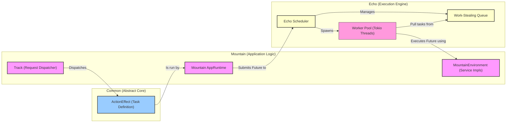

<table><tr>
<td colspan="1"> <h3 align="center"> <picture>
<source media="(prefers-color-scheme: dark)" srcset="https://PlayForm.Cloud/Dark/Image/GitHub/Land.svg">
<source media="(prefers-color-scheme: light)" srcset="https://PlayForm.Cloud/Image/GitHub/Land.svg">

</picture> </h3> </td> <td colspan="3" valign="top"> <h3 align="center"> Echo 📣
</h3> </td>
</tr></table>

---

# **Echo** 📣 A Resilient, High-Performance Task Scheduler for Rust

[](https://github.com/CodeEditorLand/Echo/blob/Current/LICENSE)
[](https://crates.io/crates/echo-scheduler)
[](https://tokio.rs/)
[](https://github.com/crossbeam-rs/crossbeam)

Welcome to **Echo**! This crate provides a powerful, structured concurrency
runtime for Rust applications, built on a high-performance **work-stealing
scheduler**. It is designed to be the core execution engine for the `Mountain`
backend, integrating seamlessly with the declarative `ActionEffect` system
defined in the `Common` crate. **Echo** moves beyond simple task spawning
(`tokio::spawn`) to provide a robust framework for managing, prioritizing, and
executing complex asynchronous workflows with resilience and efficiency.

**Echo** is engineered to:

1.  **Provide High-Performance Concurrency:** Utilizes a lock-free,
    work-stealing queue (`crossbeam-deque`) to ensure all worker threads remain
    busy, maximizing CPU utilization and application throughput.
2.  **Enable Structured Task Management:** Offers a clean API for submitting
    tasks with different priorities, allowing critical, UI-blocking operations
    to pre-empt background work.
3.  **Integrate Natively with Effect Systems:** Designed from the ground up to
    be the execution backend for systems like the `ActionEffect` pattern,
    providing a bridge between declarative task definitions and their concrete
    execution.

---

## Key Features 🔐

- **Work-Stealing Scheduler:** Implements a modern work-stealing algorithm to
  efficiently distribute tasks across a pool of worker threads, preventing
  bottlenecks and maximizing parallelism.
- **Task Prioritization:** Supports submitting tasks with `High`, `Normal`, or
  `Low` priority, ensuring that latency-sensitive operations are handled
  immediately.
- **Fluent Builder API:** A clean `SchedulerBuilder` allows for easy
  configuration of the worker pool and other scheduler parameters.
- **Graceful Shutdown:** Provides a `Shutdown()` method to ensure all worker
  threads complete their current tasks and exit cleanly, preventing orphaned
  threads.
- **Built for `ActionEffect`:** Serves as the ideal backend for effect systems,
  providing the runtime engine that executes declarative, asynchronous workflows
  defined in other parts of the application.

---

## Core Architecture Principles 🏗️

| Principle                  | Description                                                                                                                                             | Key Components Involved                     |
| :------------------------- | :------------------------------------------------------------------------------------------------------------------------------------------------------ | :------------------------------------------ |
| **Performance**            | Use lock-free data structures (`crossbeam-deque`) and a work-stealing algorithm to achieve maximum throughput and low-latency task execution.           | `queue::StealingQueue`, `scheduler::Worker` |
| **Structured Concurrency** | Manage all asynchronous operations within a supervised pool of workers, providing graceful startup and shutdown, unlike fire-and-forget `tokio::spawn`. | `scheduler::Scheduler`, `SchedulerBuilder`  |
| **Decoupling**             | Separate the _submission_ of a task from its _execution_. The `AppRuntime` submits work, and the `Scheduler` handles how, when, and where it runs.      | `Scheduler::Submit`, `task::Task`           |
| **Resilience**             | The scheduler's design is inherently resilient, as the failure of one task (if it panics) does not bring down the entire worker pool.                   | `scheduler::Worker` (execution loop)        |
| **Composability**          | Provide a simple, generic `Submit` API that accepts any `Future<Output = ()>`, making it easy to integrate with any asynchronous Rust code.             | `task::Task`, `Scheduler::Submit`           |

---

## Deep Dive & Component Breakdown 🔬

To understand how `Echo`'s internal components interact to provide these
services, please refer to the detailed technical breakdown in
[`docs/Deep Dive.md`](docs/Deep%20Dive.md). This document explains the roles of
the `Task`, `StealingQueue`, `Worker`, and `Scheduler` in detail.

---

## `Echo` in the Land Ecosystem 📣 + 🏞️

This diagram illustrates `Echo`'s role as the core execution engine within the
`Mountain` backend.


```mermaid
graph LR
    classDef common fill:#9cf,stroke:#333,stroke-width:2px;
    classDef mountain fill:#f9f,stroke:#333,stroke-width:2px;
    classDef echo fill:#ffc,stroke:#333,stroke-width:2px;
    classDef rust fill:#f9d,stroke:#333,stroke-width:1px;


	subgraph "Common (Abstract Core)"
		ActionEffect["ActionEffect (Task Definition)"]:::common
	end

	subgraph "Mountain (Application Logic)"
        AppRuntime["Mountain AppRuntime"]:::mountain
        MountainEnv["MountainEnvironment (Service Impls)"]:::mountain
        Track["Track (Request Dispatcher)"]:::mountain
	end

	subgraph "Echo (Execution Engine)"
		Scheduler["Echo Scheduler"]:::echo
		WorkStealingQueue["Work-Stealing Queue"]:::echo
        WorkerPool["Worker Pool (Tokio Threads)"]:::rust

        Scheduler -- Manages --> WorkStealingQueue;
        Scheduler -- Spawns --> WorkerPool;
        WorkerPool -- Pull tasks from --> WorkStealingQueue;
	end

    Track -- Dispatches --> ActionEffect;
    ActionEffect -- Is run by --> AppRuntime;
    AppRuntime -- Submits Future to --> Scheduler;
    WorkerPool -- Executes Future using --> MountainEnv;
```

---

## Project Structure Overview 🗺️

The `Echo` repository is organized into a few core modules:

```
Echo/
└── Source/
    ├── lib.rs                   # Crate root, declares public modules.
    ├── scheduler/               # The main public API: Scheduler and SchedulerBuilder.
    ├── queue/                   # The internal, high-performance work-stealing queue.
    └── task/                    # The internal definition of a Task and its Priority.
```

---

## Getting Started 🚀

### Installation

```sh
# In your Cargo.toml
[dependencies]
echo-scheduler = "0.1.0" # Or use a path dependency for local development
```

**Key Dependencies:**

- `tokio`: `^1.0` (with `full` features)
- `crossbeam-deque`: `^0.8`
- `rand`: `^0.8`
- `log`: `^0.4`

### Usage

`Echo` is designed to be integrated into an application's main entry point and
used via a shared `AppRuntime`.

1.  **Initialize the Scheduler:** Create and start the scheduler when your
    application starts.

    ```rust
    // In your application's main.rs
    use Echo::scheduler::{Scheduler, SchedulerBuilder};
    use std::sync::Arc;

    let scheduler = Arc::new(SchedulerBuilder::New().WithWorkerCount(8).Build());
    ```

2.  **Create a Runtime:** Construct a runtime object that holds the scheduler
    and any other necessary context (like your application's `Environment`).

    ```rust
    use Common::effect::AppRuntime as AppRuntimeTrait;

    struct MyAppRuntime {
        scheduler: Arc<Scheduler>,
        // ... other context
    }

    // This runtime will submit tasks to the scheduler.
    // (See the full implementation from our synthesis session for details).
    ```

3.  **Submit Tasks:** Use your runtime to submit asynchronous work to the
    scheduler.

    ```rust
    use Echo::task::Priority;

    // An example async block to be run by the scheduler
    let my_task = async {
        println!("This is running on a worker thread!");
        // ... perform some work ...
    };

    // The runtime's `Run` method would internally call this:
    runtime.scheduler.Submit(my_task, Priority::Normal);
    ```

---

## License ⚖️

This project is released into the public domain under the **Creative Commons CC0
Universal** license. You are free to use, modify, distribute, and build upon
this work for any purpose, without any restrictions. For the full legal text,
see the [`LICENSE`](LICENSE) file.

---

## Changelog 📜

Stay updated with our progress! See [`CHANGELOG.md`](CHANGELOG.md) for a history
of changes specific to **Echo**.

---

## Funding & Acknowledgements 🙏🏻

**Echo** is a core element of the **Land** ecosystem. This project is funded
through [NGI0 Commons Fund](https://nlnet.nl/commonsfund), a fund established by
[NLnet](https://nlnet.nl) with financial support from the European Commission's
[Next Generation Internet](https://ngi.eu) program. Learn more at the
[NLnet project page](https://nlnet.nl/project/Land).

| **Land**                                                                                                                                            | PlayForm                                                                                                                                                 | NLnet                                                                                      | NGI0 Commons Fund                                                                                                                                 |
| :-------------------------------------------------------------------------------------------------------------------------------------------------- | :------------------------------------------------------------------------------------------------------------------------------------------------------- | :----------------------------------------------------------------------------------------- | :------------------------------------------------------------------------------------------------------------------------------------------------ |
| [](https://editor.land) | [](https://playform.cloud) | [](https://nlnet.nl) | [](https://nlnet.nl/commonsfund) |

---

**Project Maintainers**: Source Open
([Source/Open@Editor.Land](mailto:Source/Open@Editor.Land)) |
[GitHub Repository](https://github.com/CodeEditorLand/Echo) |
[Report an Issue](https://github.com/CodeEditorLand/Echo/issues) |
[Security Policy](https://github.com/CodeEditorLand/Echo/security/policy)
