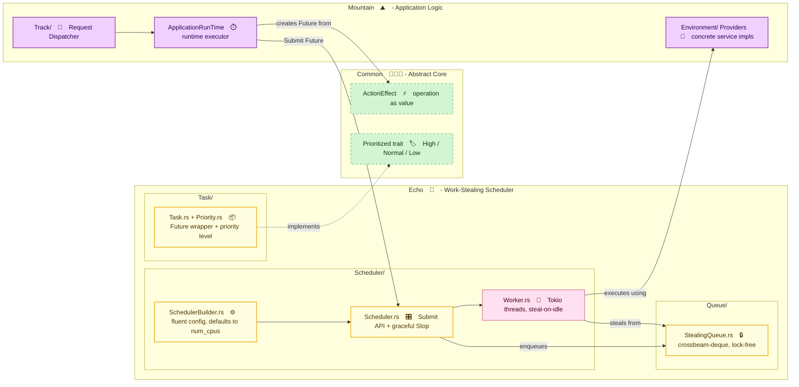

<table>
	<tr>
		<td align="left" valign="middle"><h3 align="left">Echo&#x2001;📣</h3></td>
		<td align="left" valign="middle"><h3 align="left">+</h3></td>
		<td align="left" valign="middle">
			<h3 align="left">
				<a href="https://editor.land" target="_blank">
					<picture>
						<source media="(prefers-color-scheme: dark)" srcset="https://editor.land/Dark/Image/GitHub/Land.svg" />
						<source media="(prefers-color-scheme: light)" srcset="https://editor.land/Image/GitHub/Land.svg" />
						
					</picture>
				</a>
			</h3>
		</td>
		<td align="left" valign="middle"><h3 align="left"><a href="https://editor.land" target="_blank">Land&#x2001;🏞️</a></h3></td>
	</tr>
</table>

---

# **Echo**&#x2001;📣

A Resilient, High-Performance Task Scheduler for Rust

> **`tokio::spawn` gives you fire-and-forget concurrency - no priority, no
> backpressure, no structured shutdown. CPU-bound work blocks the executor,
> starving latency-sensitive tasks. A task scheduler without priority awareness
> means a background file-index can stall a keystroke.**
>
> _"Every CPU core stays busy. High-priority tasks always pre-empt background
> work. Shutdown drains gracefully, never drops a task in flight."_

[](https://github.com/CodeEditorLand/Echo/tree/Current/LICENSE)
[](https://www.rust-lang.org/) [](https://crates.io/crates/Echo)
[](https://www.rust-lang.org/) [](https://www.rust-lang.org/)
[](https://tokio.rs/)
[](https://github.com/crossbeam-rs/crossbeam)

**[Rust API Documentation](https://rust.documentation.echo.editor.land/)**&#x2001;📖

---

## Overview

**Echo** is a task scheduler for `Rust` that decides which work runs when - and
on which CPU core. It's the execution engine that
`Mountain`&#x2001;⛰️ uses to run everything from processing keystrokes to
indexing files in the background.

The standard `tokio::spawn` is fine for network I/O, but CPU-heavy work -
parsing, diffing, indexing - can block the executor and stall everything else.
Echo solves this with three mechanisms:

- **Priorities** - Tasks like UI responses and keystroke processing run at
  `High` priority, always jumping ahead of background work like file indexing or
  syntax analysis.
- **Work-stealing** - If one worker is busy and another is idle, the idle one
  pulls tasks from the busy one's queue. No core sits idle while work is
  waiting.
- **Structured shutdown** - When the application shuts down, Echo drains its
  queues gracefully. No task gets dropped mid-flight.

Echo is designed as two layers. A generic `Queue` module handles the core
work-stealing logic (usable in any project). A `Scheduler` layer on top adds
priority ordering, worker management, and a builder API for configuration.

---

## Key Features&#x2001;📣

**Work-Stealing Scheduler** - Implements a priority-aware work-stealing
algorithm using `crossbeam-deque` to efficiently distribute tasks across a pool
of worker threads. Idle workers automatically steal from busy peers' local
deques and the global injector queue, ensuring no core sits idle while work is
available.

**Task Prioritization** - Supports submitting tasks with `High`, `Normal`, or
`Low` priority levels. High-priority tasks are always dequeued first from local
and global deques, ensuring that latency-sensitive operations respond
immediately while background work yields gracefully.

**Fluent Builder API** - The `SchedulerBuilder` provides a clean, chainable
configuration interface. It defaults to the number of logical CPU cores with a
minimum of two workers, and supports explicit worker count overrides and named
queue configuration for future extensibility.

**Graceful Shutdown** - The `Stop()` method signals all worker threads to
terminate and waits for each to complete its current task before joining. An
automatic `Drop` guard ensures workers are signaled to stop even if the
scheduler is dropped without an explicit shutdown call.

**Lock-Free Performance** - All queue operations use `crossbeam-deque`'s
lock-free primitives. New tasks submitted from outside a worker go into a shared
global queue. Each worker pulls from its own local queue (fast, cache-friendly),
steals from peers' queues when idle, and falls back to the global queue as a
last resort. No mutex, no contention.

**Decoupled Queue Library** - The generic `Queue` module provides the core
work-stealing logic as a standalone library, independent of any specific
scheduler implementation. The `StealingQueue<TTask>` accepts any type
implementing the `Prioritized` trait, making it reusable across projects.

---

## Core Architecture Principles&#x2001;🏗️

| Principle                  | Description                                                                                                                                                                                    | Key Components                                                      |
| -------------------------- | ---------------------------------------------------------------------------------------------------------------------------------------------------------------------------------------------- | ------------------------------------------------------------------- |
| **Work Stealing**          | Use lock-free data structures (`crossbeam-deque`) with random victim selection to keep all cores productive. Idle workers pull from peer local deques and the global injector queue.           | `Queue::StealingQueue`, `Scheduler::Worker`                         |
| **Priority Scheduling**    | Three priority tiers (`High`, `Normal`, `Low`) determine deque ordering. The `Prioritized` trait decouples priority assignment from the queue implementation.                                  | `Task::Priority`, `Queue::StealingQueue::Prioritized`               |
| **Structured Concurrency** | Manage all asynchronous operations within a supervised pool of workers with explicit startup and graceful shutdown. The `Drop` guard guarantees clean teardown.                                | `Scheduler::Scheduler`, `Scheduler::SchedulerBuilder`               |
| **Decoupling**             | Separate the generic queueing logic from the application-specific scheduler. The scheduler uses the queue to run tasks; the queue knows nothing about `Tokio` workers or `Mountain`&#x2001;⛰️. | `Queue::StealingQueue<TTask>`, `Task::Task`, `Scheduler::Scheduler` |
| **Composability**          | A simple `Submit` API accepts any `Future<Output = ()> + Send`, making it easy to integrate with any asynchronous `Rust` codebase.                                                             | `Task::Task`, `Scheduler::Scheduler::Submit`                        |

---

## System Architecture


```mermaid
graph LR
    classDef common   fill:#d4f5d4,stroke:#27ae60,stroke-width:1px,stroke-dasharray:5 5,color:#0a3a0a;
    classDef mountain fill:#f0d0ff,stroke:#9b59b6,stroke-width:2px,color:#2c0050;
    classDef echo     fill:#fffde0,stroke:#f0b429,stroke-width:2px,color:#4a3500;
    classDef worker   fill:#ffe0f0,stroke:#c0396a,stroke-width:1px,color:#4a0020;

    subgraph COMMON["Common　🧑🏻‍🏭 - Abstract Core"]
        ActionEffect["ActionEffect ⚡ operation as value"]:::common
        Prioritized["Prioritized trait 🏷️ High / Normal / Low"]:::common
    end

    subgraph MOUNTAIN["Mountain ⛰️ - Application Logic"]
        Track["Track/ 🎯 Request Dispatcher"]:::mountain
        AppRunTime["ApplicationRunTime ⏱️ runtime executor"]:::mountain
        MountainEnv["Environment/ Providers 🔧 concrete service impls"]:::mountain
        Track --> AppRunTime
    end

    subgraph ECHO["Echo 📣 - Work-Stealing Scheduler"]
        direction TB
        subgraph SCHEDULER["Scheduler/"]
            SchedBuilder["SchedulerBuilder.rs ⚙️ fluent config, defaults to num_cpus"]:::echo
            SchedCore["Scheduler.rs 🎛️ Submit API + graceful Stop"]:::echo
            Workers["Worker.rs 🏃 Tokio threads, steal-on-idle"]:::worker
            SchedBuilder --> SchedCore
            SchedCore --> Workers
        end
        subgraph QUEUE["Queue/"]
            StealQ["StealingQueue.rs 🔒 crossbeam-deque, lock-free"]:::echo
        end
        subgraph TASK["Task/"]
            TaskDef["Task.rs + Priority.rs 📦 Future wrapper + priority level"]:::echo
        end

        Workers -- steals from --> StealQ
        SchedCore -- enqueues --> StealQ
        TaskDef -.implements.-> Prioritized
    end

    AppRunTime -- creates Future from --> ActionEffect
    AppRunTime -- Submit Future --> SchedCore
    Workers -- executes using --> MountainEnv
```

**Connection paths:**

| Path                                  | Protocol                   | Use Case                                                                      |
| ------------------------------------- | -------------------------- | ----------------------------------------------------------------------------- |
| `Mountain`&#x2001;⛰️ → Echo&#x2001;📣 | `Submit(Future, Priority)` | Dispatch `ActionEffect`-derived futures to the worker pool                    |
| Worker → Peer Worker                  | `crossbeam-deque` steal    | Idle workers pull tasks from busy workers' local deques                       |
| Worker → Injector Queue               | `crossbeam-deque` steal    | Workers fall back to the global injector when local and peer deques are empty |
| Anything → Echo                       | `Submit(Future, Priority)` | Any application code can submit any `Future<Output = ()> + Send`              |

---

## Key Components

| Component         | Path                                   | Description                                                               |
| ----------------- | -------------------------------------- | ------------------------------------------------------------------------- |
| Library Entry     | `Source/Library.rs`                    | Crate root, declares all modules with doc comments                        |
| Scheduler         | `Source/Scheduler/Scheduler.rs`        | Main runtime: `Submit`, `Stop`, worker pool lifecycle                     |
| Scheduler Builder | `Source/Scheduler/SchedulerBuilder.rs` | Fluent builder: worker count, queue configuration, defaults to `num_cpus` |
| Worker            | `Source/Scheduler/Worker.rs`           | Per-thread execution loop with steal-on-idle logic                        |
| StealingQueue     | `Source/Queue/StealingQueue.rs`        | Generic lock-free work-stealing queue wrapping `crossbeam-deque`          |
| Queue Module      | `Source/Queue/mod.rs`                  | Module declaration for the Queue subsystem                                |
| Task              | `Source/Task/Task.rs`                  | Schedulable unit: boxed `Future` + priority metadata                      |
| Priority          | `Source/Task/Priority.rs`              | `High`, `Normal`, `Low` priority enum                                     |
| Task Module       | `Source/Task/mod.rs`                   | Module declaration for the Task subsystem                                 |

---

## Project Structure&#x2001;🗺️

```
Element/Echo/
├── Source/
│   ├── Library.rs              # Crate root (rlib), module declarations
│   ├── Queue/                  # Generic work-stealing queue library
│   │   ├── mod.rs              # Module re-exports
│   │   └── StealingQueue.rs    # Lock-free, priority-aware stealing deque
│   ├── Scheduler/              # Scheduler runtime and worker pool
│   │   ├── mod.rs              # Module re-exports
│   │   ├── Scheduler.rs        # Main scheduler: Submit + Stop lifecycle
│   │   ├── SchedulerBuilder.rs # Fluent builder with worker count config
│   │   └── Worker.rs           # Per-thread Tokio worker with steal loop
│   └── Task/                   # Task definition and priority
│       ├── mod.rs              # Module re-exports
│       ├── Task.rs             # Schedulable unit (Future + Priority)
│       └── Priority.rs         # High / Normal / Low enum
└── Documentation/
    └── GitHub/
        ├── Architecture.md     # Internal module structure and data flow
        └── DeepDive.md         # In-depth technical details
```

---

## In the Land Project

Echo serves as the core execution engine for `Mountain`&#x2001;⛰️, the native
`Rust`/`Tauri` backend of the Land Code Editor. It integrates seamlessly with
the `ActionEffect` pattern from the `Common`&#x2001;🧑🏻‍🏭 crate, executing composed
asynchronous workflows across a priority-aware worker pool.

The `Mountain` runtime submits futures derived from `ActionEffect` values to the
Echo scheduler, which distributes them across its workers alongside the concrete
`Environment` provider implementations. High-priority UI operations - keystroke
processing, command execution, diagnostics - always pre-empt background work
like file indexing and syntax analysis.

| Layer                  | Role                                       | Integration with Echo                                          |
| ---------------------- | ------------------------------------------ | -------------------------------------------------------------- |
| **Mountain**&#x2001;⛰️ | Application backend (`Tauri` native shell) | Submits `ActionEffect`-derived futures to Echo                 |
| **Echo**&#x2001;📣     | Work-stealing task scheduler               | Distributes work across `Tokio` workers with priority ordering |
| **Common**&#x2001;🧑🏻‍🏭   | Abstract traits and shared types           | Provides `Prioritized` trait and `ActionEffect` pattern        |

---

## Getting Started&#x2001;🚀

### Prerequisites

- **Rust** 1.95.0 or later (edition 2024)
- A `Tokio` runtime (Echo uses `tokio` internally)

### Installation

Add Echo to your project via the Land workspace:

```toml
[dependencies]
Echo = { git = "https://github.com/CodeEditorLand/Echo.git", branch = "Current" }
```

The crate depends on `tokio`, `crossbeam-deque`, `rand`, `log`, `num_cpus`, and
`Common` from the Land workspace. All dependencies are resolved through the
workspace `Cargo.toml` configuration.

### Usage

First, create and start the scheduler when your application initializes. The
builder defaults to the number of logical CPU cores, with a minimum of two
workers to ensure work-stealing is viable:

```rust
use std::sync::Arc;
use Echo::Scheduler::SchedulerBuilder;
use Echo::Task::Priority;

let Scheduler = Arc::new(SchedulerBuilder::Create().WithWorkerCount(8).Build());
```

Submit asynchronous tasks from anywhere in your application using the scheduler
instance. Tasks are queued by priority and executed by the next available
worker:

```rust
let MyTask = async {
    println!("This is running on an Echo worker thread!");
    // ... perform some work ...
};

// Submit the task with a desired priority
Scheduler.Submit(MyTask, Priority::Normal);

// Another example with high priority
Scheduler.Submit(async { /* critical work */ }, Priority::High);
```

Before your application exits, ensure a clean shutdown of all worker threads.
The `Stop()` method drains the queue and waits for in-flight tasks to complete:

```rust
// Note: Arc::try_unwrap requires the Arc to have only one strong reference.
if let Ok(mut Scheduler) = Arc::try_unwrap(Scheduler) {
    Scheduler.Stop().await;
}
```

### Key Dependencies

| Crate              | Purpose                                                                                                                           |
| ------------------ | --------------------------------------------------------------------------------------------------------------------------------- |
| `tokio`            | Async runtime powering worker threads                                                                                             |
| `crossbeam-deque`  | Lock-free work-stealing double-ended queue primitives                                                                             |
| `rand`             | Random victim selection for work-stealing                                                                                         |
| `num_cpus`         | Default worker count detection                                                                                                    |
| `log`              | Structured logging for scheduler and worker lifecycle                                                                             |
| `Common`&#x2001;🧑🏻‍🏭 | Shared traits (`Prioritized`) and `ActionEffect` pattern; also provides the `CaptureEvent` telemetry hook used on scheduler start |

---

## Security&#x2001;🔒

As a pure library crate, Echo provides architectural guarantees rather than
runtime enforcement:

| Layer                   | Mechanism                                                                                            |
| ----------------------- | ---------------------------------------------------------------------------------------------------- |
| **Safe Rust**           | No unsafe code - all operations go through safe `Rust` abstractions                                  |
| **Structured shutdown** | The `Drop` guard ensures worker threads are signaled to stop, preventing orphaned tasks              |
| **Bounded concurrency** | Worker pool size is configurable and capped, preventing unbounded resource consumption               |
| **Decoupled design**    | The `Queue` module is generic and independent; a compromised task cannot corrupt the scheduler state |

---

## Compatibility

Echo is designed to be compatible with:

| Target                  | Integration                                                                              |
| ----------------------- | ---------------------------------------------------------------------------------------- |
| **Mountain**&#x2001;⛰️  | Primary consumer - submits `ActionEffect`-derived futures via `Submit(Future, Priority)` |
| **Common**&#x2001;🧑🏻‍🏭    | Implements `Prioritized` trait and accepts `ActionEffect`-compatible futures             |
| **Any `Tokio` runtime** | Echo uses `Tokio` internally and integrates with any `Tokio`-based `Rust` application    |

---

## API Reference

- **[Rust API Documentation](https://rust.documentation.echo.editor.land/)**&#x2001;📖

---

## Related Documentation

- [Architecture Overview](https://Editor.Land/Doc/architecture) - Land system
  architecture
- [Deep Dive](Documentation/GitHub/DeepDive.md) - In-depth technical details of
  the work-stealing algorithm
- [Land Documentation](../../Documentation/GitHub/README.md) - Complete
  documentation index
- [`Mountain`](https://github.com/CodeEditorLand/Mountain)&#x2001;⛰️ - Primary
  consumer of Echo, native `Tauri` desktop shell
- [`Common`](https://github.com/CodeEditorLand/Common)&#x2001;🧑🏻‍🏭 - Abstract
  traits and `ActionEffect` system
- [Why Rust](https://Editor.Land/Doc/why-rust)
- [Contribution Guide](https://github.com/CodeEditorLand/Echo/tree/Current/CONTRIBUTING.md)

---

## License&#x2001;⚖️

This project is released into the public domain under the **Creative Commons CC0
Universal** license. You are free to use, modify, distribute, and build upon
this work for any purpose, without any restrictions. For the full legal text,
see the [`LICENSE`](https://github.com/CodeEditorLand/Echo/tree/Current/LICENSE)
file.

---

## Changelog&#x2001;📜

Stay updated with our progress! See
[`CHANGELOG.md`](https://github.com/CodeEditorLand/Echo/tree/Current/CHANGELOG.md)
for a history of changes.

---

## Funding & Acknowledgements&#x2001;🙏🏻

**Land**&#x2001;🏞️ is proud to be an open-source endeavor. Our journey is
significantly supported by the organizations and projects that believe in the
future of open-source software.

This project is funded through
[NGI0 Commons Fund](https://NLnet.NL/commonsfund), a fund established by
[NLnet](https://NLnet.NL) with financial support from the European Commission's
[Next Generation Internet](https://ngi.eu) program. Learn more at the
[NLnet project page](https://NLnet.NL/project/Land).

<table>
	<thead>
		<tr>
			<th align="left"><strong>Land</strong></th>
			<th align="left"><strong>PlayForm</strong></th>
			<th align="left"><strong>NLnet</strong></th>
			<th align="left"><strong>NGI0 Commons Fund</strong></th>
		</tr>
	</thead>
	<tbody>
		<tr>
			<td align="left" valign="middle"><a href="https://editor.land"></a></td>
			<td align="left" valign="middle"><a href="https://PlayForm.Cloud"></a></td>
			<td align="left" valign="middle"><a href="https://NLnet.NL"></a></td>
			<td align="left" valign="middle"><a href="https://NLnet.NL/commonsfund"></a></td>
		</tr>
	</tbody>
</table>

---

**Project Maintainers**: Source Open
([Source/Open@editor.land](mailto:Source/Open@editor.land)) |
[GitHub Repository](https://github.com/CodeEditorLand/Echo) |
[Report an Issue](https://github.com/CodeEditorLand/Echo/issues) |
[Security Policy](https://github.com/CodeEditorLand/Echo/security/policy)
