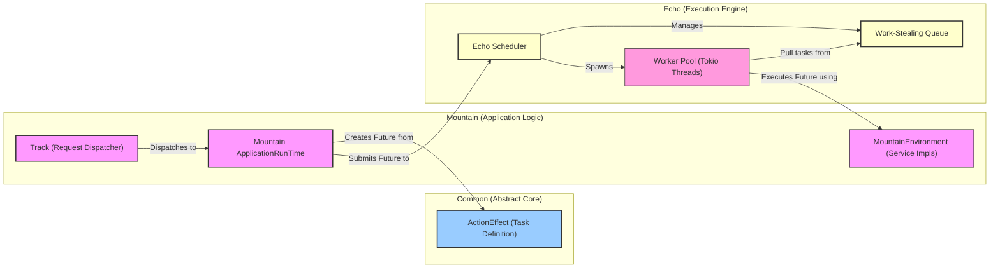

<table>
	<tr>
		<td align="left" valign="middle">
			<h3 align="left"> Echo</h3>
		</td>
		<td align="left" valign="middle">
			<h3 align="left">
				&#x2001;📣
			</h3>
		</td>
		<td align="left" valign="middle">
			<h3 align="left"> + </h3>
		</td>
		<td align="left" valign="middle">
			<h3 align="left">
				<a href="https://Editor.Land" target="_blank">
					<picture>
						<source media="(prefers-color-scheme: dark)" srcset="https://PlayForm.Cloud/Dark/Image/GitHub/Land.svg">
						<source media="(prefers-color-scheme: light)" srcset="https://PlayForm.Cloud/Image/GitHub/Land.svg">
						
					</picture>
				</a>
			</h3>
		</td>
		<td align="left" valign="middle">
			<h3 align="left">
				<a href="https://Editor.Land" target="_blank">
					Land
				</a>
			</h3>
		</td>
		<td align="left" valign="middle">
			<h3 align="left">
				&#x2001;🏞️
			</h3>
		</td>
	</tr>
</table>

---

# **Echo**&#x2001;📣

A Resilient, High-Performance Task Scheduler for Rust

Echo is a bounded work-stealing task scheduler designed as the core execution
engine for application backends like Mountain. It provides structured
concurrency with priority-based task scheduling, ensuring that latency-sensitive
operations always take precedence over background work. The scheduler
distributes tasks across a Tokio thread pool using lock-free work-stealing
queues, maximizing CPU utilization without the memory and IPC overhead of
process-based parallelism.

The system separates generic queueing logic from application-specific scheduling
concerns through a clean abstraction layer. Workers consume tasks from local
FIFO deques and attempt to steal from peer workers or the global injector queue
when local work is exhausted. This architecture delivers low-latency execution
for foreground operations while efficiently processing batch work in the
background.

[](https://github.com/CodeEditorLand/Echo/tree/Current/LICENSE)
[](https://www.rust-lang.org/)&#x2001;[](https://crates.io/crates/Echo)
[](https://www.rust-lang.org/)&#x2001;[](https://www.rust-lang.org/)
[](https://tokio.rs/)
[](https://github.com/crossbeam-rs/crossbeam)

**[Rust API Documentation](https://Rust.Documentation.Editor.Land/Echo/)**&#x2001;📖

Welcome to **Echo**! This crate provides a structured concurrency runtime for
Rust applications, built on a high-performance work-stealing scheduler. It is
designed to be the core execution engine for application backends like
`Mountain`, integrating seamlessly with declarative systems like the
`ActionEffect` pattern. Echo moves beyond simple task spawning to provide a
robust framework for managing, prioritizing, and executing complex asynchronous
workflows with resilience and efficiency.

---

## Key Features&#x2001;🔐

**Work-Stealing Scheduler:** Implements a priority-aware work-stealing algorithm
using `crossbeam-deque` to efficiently distribute tasks across a pool of worker
threads. Idle workers automatically steal from busy workers, eliminating
scheduling bottlenecks and keeping all cores productive.

**Task Prioritization:** Supports submitting tasks with `High`, `Normal`, or
`Low` priority levels. High-priority tasks are executed first from local and
global deques, ensuring that latency-sensitive operations respond immediately
while background work yields gracefully.

**Fluent Builder API:** The `SchedulerBuilder` provides a clean, chainable
configuration interface for the worker pool. It defaults to the number of
logical CPU cores with a minimum of two workers, and supports explicit worker
count overrides as well as named queue configuration for future extensibility.

**Graceful Shutdown:** The `Stop()` method signals all worker threads to
terminate and waits for each to complete its current task before joining. An
automatic `Drop` guard ensures workers are signaled to stop even if the
scheduler is dropped without an explicit shutdown call.

**Decoupled Architecture:** The generic `Queue` module provides the core
work-stealing logic as a standalone library, independent of any specific
scheduler implementation. The `StealingQueue<TTask>` accepts any type
implementing the `Prioritized` trait, making it reusable across projects.

---

## Project Structure Overview&#x2001;🗺️

```
Echo/
├── Source/
│   ├── Library.rs               # Module declarations and crate-level exports.
│   ├── Queue/                   # Work-stealing deque implementation (crossbeam-based).
│   ├── Scheduler/               # Worker pool, scheduling logic, and builder API.
│   └── Task/                    # Task definitions, priorities, and effect integration.
└── ...
```

---

## Core Architecture Principles&#x2001;🏗️

| Principle                  | Description                                                                                                                                                     | Key Components Involved                                             |
| :------------------------- | :-------------------------------------------------------------------------------------------------------------------------------------------------------------- | :------------------------------------------------------------------ |
| **Performance**            | Use lock-free data structures (`crossbeam-deque`) and a high-performance work-stealing algorithm to achieve maximum throughput and low-latency task execution.  | `Queue::StealingQueue`, `Scheduler::Worker`                         |
| **Structured Concurrency** | Manage all asynchronous operations within a supervised pool of workers, providing graceful startup and shutdown, unlike fire-and-forget `tokio::spawn`.         | `Scheduler::Scheduler`, `Scheduler::SchedulerBuilder`               |
| **Decoupling**             | Separate the generic **Queueing Logic** from the application-specific **Scheduler Implementation**. The scheduler uses the queue to run its tasks.              | `Queue::StealingQueue<TTask>`, `Scheduler::Scheduler`, `Task::Task` |
| **Resilience**             | The scheduler's design is inherently resilient; the failure of one task (if it panics) is contained within its `tokio` task and does not crash the worker pool. | `Scheduler::Worker::Run`                                            |
| **Composability**          | Provide a simple `Submit` API that accepts any `Future<Output = ()>`, making it easy to integrate with any asynchronous Rust code.                              | `Task::Task`, `Scheduler::Scheduler::Submit`                        |

---

## Deep Dive & Component Breakdown&#x2001;🔬

To understand how Echo's internal components interact to provide these services,
please refer to the detailed technical breakdown in
[`Documentation/GitHub/DeepDive.md`](https://github.com/CodeEditorLand/Echo/tree/Current/Documentation/GitHub/DeepDive.md).
This document explains the roles of the `Task`, `StealingQueue`, `Worker`, and
`Scheduler` in detail.

---

## `Echo` in the Land Ecosystem&#x2001;📣 + &#x2001;🏞️

This diagram illustrates Echo's role as the core execution engine within the
`Mountain` backend.


```mermaid
graph LR
    classDef common fill:#9cf,stroke:#333,stroke-width:2px;
    classDef mountain fill:#f9f,stroke:#333,stroke-width:2px;
    classDef echo fill:#ffc,stroke:#333,stroke-width:2px;
    classDef rust fill:#f9d,stroke:#333,stroke-width:1px;

	subgraph "Common (Abstract Core)"
		ActionEffect["ActionEffect (Task Definition)"]:::common
	end

	subgraph "Mountain (Application Logic)"
        ApplicationRunTime["Mountain ApplicationRunTime"]:::mountain
        MountainEnvironment["MountainEnvironment (Service Impls)"]:::mountain
        Track["Track (Request Dispatcher)"]:::mountain
	end

	subgraph "Echo (Execution Engine)"
		Scheduler["Echo Scheduler"]:::echo
		WorkStealingQueue["Work-Stealing Queue"]:::echo
        WorkerPool["Worker Pool (Tokio Threads)"]:::rust

        Scheduler -- Manages --> WorkStealingQueue;
        Scheduler -- Spawns --> WorkerPool;
        WorkerPool -- Pull tasks from --> WorkStealingQueue;
	end

    Track -- Dispatches to --> ApplicationRunTime;
    ApplicationRunTime -- Creates Future from --> ActionEffect;
    ApplicationRunTime -- Submits Future to --> Scheduler;
    WorkerPool -- Executes Future using --> MountainEnvironment;
```

---

## Project Structure Overview&#x2001;🗺️

The Echo repository is organized into a few core modules with a clear separation
of concerns:

```
Echo/
└── Source/
    ├── Library.rs               # Crate root, declares all modules.
    ├── Scheduler/               # The main public API: Scheduler and SchedulerBuilder.
    ├── Queue/                   # The generic, high-performance work-stealing queue library.
    └── Task/                    # The concrete definition of a Task and its Priority.
```

---

## Getting Started&#x2001;🚀

### Installation&#x2001;📥

To add Echo to your project, add the following to your Cargo.toml:

```toml
[dependencies]
Echo = { git = "https://github.com/CodeEditorLand/Echo.git", branch = "Current" }
```

The crate depends on `tokio`, `crossbeam-deque`, `rand`, `log`, `num_cpus`, and
`Common` from the Land workspace. All dependencies are resolved through the
workspace `Cargo.toml` configuration.

### Usage&#x2001;🚀

First, create and start the scheduler when your application initializes. The
builder defaults to the number of logical CPU cores, with a minimum of two
workers to ensure work-stealing is viable:

```rust
use std::sync::Arc;
use Echo::Scheduler::SchedulerBuilder;
use Echo::Task::Priority;

let Scheduler = Arc::new(SchedulerBuilder::Create().WithWorkerCount(8).Build());
```

Submit asynchronous tasks from anywhere in your application using the scheduler
instance. Tasks are queued by priority and executed by the next available
worker:

```rust
let MyTask = async {
    println!("This is running on an Echo worker thread!");
    // ... perform some work ...
};

// Submit the task with a desired priority
Scheduler.Submit(MyTask, Priority::Normal);

// Another example with high priority
Scheduler.Submit(async { /* critical work */ }, Priority::High);
```

Before your application exits, ensure a clean shutdown of all worker threads.
The `Stop()` method drains the queue and waits for in-flight tasks to complete:

```rust
// Note: Arc::try_unwrap requires the Arc to have only one strong reference.
if let Ok(mut Scheduler) = Arc::try_unwrap(Scheduler) {
    Scheduler.Stop().await;
}
```

---

## Help Us Boost Performance: A Call for Contributions!&#x2001;🫱🏻‍🫲🏿

Echo is built on a high-performance foundation, but there is always room to push
the boundaries of speed and efficiency. We maintain a detailed roadmap of
features and performance optimizations, with tasks suitable for all skill
levels.

| Contribution Level | Example Tasks                                             |
| :----------------- | :-------------------------------------------------------- |
| **Quick Wins**     | Implement faster random number generation for stealing.   |
| **Architectural**  | Add a notification-based wake system for idle workers.    |
| **Expert Tuning**  | Build a criterion benchmark suite; implement CPU pinning. |
| **Advanced Logic** | Introduce an anti-starvation mechanism for tasks.         |

**Interested in tackling one of these challenges?** &#x2001;👉🏻

- **[Check out our full TODO](https://github.com/CodeEditorLand/Echo/tree/Current/Documentation/GitHub/Todo.md)**
  for challenges!
- **[Follow our Contribution Guide](https://github.com/CodeEditorLand/Echo/tree/Current/CONTRIBUTING.md)**
  to get started!

---

## See Also

- [Echo Documentation](https://editor.land/Doc/echo)
- [Architecture Overview](https://editor.land/Doc/architecture)
- [Why Rust](https://editor.land/Doc/why-rust)
- [Mountain](https://github.com/CodeEditorLand/Mountain)
- [Common](https://github.com/CodeEditorLand/Common)

---

## License&#x2001;⚖️

This project is released into the public domain under the Creative Commons CC0
Universal license. You are free to use, modify, distribute, and build upon this
work for any purpose, without any restrictions. For the full legal text, see the
[`LICENSE`](https://github.com/CodeEditorLand/Echo/tree/Current/) file.

---

## Changelog&#x2001;📜

Stay updated with our progress. See
[`CHANGELOG.md`](https://github.com/CodeEditorLand/Echo/tree/Current/CHANGELOG.md)
for a history of changes specific to Echo.

---

## Funding \& Acknowledgements&#x2001;🙏🏻

Echo is a core element of the Land ecosystem. This project is funded through
[NGI0 Commons Fund](https://NLnet.NL/commonsfund), a fund established by
[NLnet](https://NLnet.NL) with financial support from the European Commission's
[Next Generation Internet](https://ngi.eu) program. Learn more at the
[NLnet project page](https://NLnet.NL/project/Land).

The project is operated by PlayForm, based in Sofia, Bulgaria.

PlayForm acts as the open-source steward for Code Editor Land under the NGI0
Commons Fund grant.

<table>
	<thead>
		<tr>
			<th align="left"><strong>Land</strong></th>
			<th align="left"><strong>PlayForm</strong></th>
			<th align="left"><strong>NLnet</strong></th>
			<th align="left"><strong>NGI0 Commons Fund</strong></th>
		</tr>
	</thead>
	<tbody>
		<tr>
			<td align="left" valign="middle">
				<a href="https://Editor.Land">
					
				</a>
			</td>
			<td align="left" valign="middle">
				<a href="https://PlayForm.Cloud">
					
				</a>
			</td>
			<td align="left" valign="middle">
				<a href="https://NLnet.NL">
					
				</a>
			</td>
			<td align="left" valign="middle">
				<a href="https://NLnet.NL/commonsfund">
					
				</a>
			</td>
		</tr>
	</tbody>
</table>

---

**Project Maintainers**: Source Open
([Source/Open@Editor.Land](mailto:Source/Open@Editor.Land)) |
[GitHub Repository](https://github.com/CodeEditorLand/Echo) |
[Report an Issue](https://github.com/CodeEditorLand/Echo/issues) |
[Security Policy](https://github.com/CodeEditorLand/Echo/security/policy)
