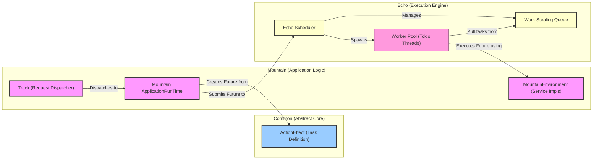

<table>
	<tr>
		<td align="left" valign="middle">
			<h3 align="left"> Echo</h3>
		</td>
		<td align="left" valign="middle">
			<h3 align="left">
				📣
			</h3>
		</td>
		<td align="left" valign="middle">
			<h3 align="left"> + </h3>
		</td>
		<td align="left" valign="middle">
			<h3 align="left">
				<a href="https://Editor.Land" target="_blank">
					<picture>
						<source media="(prefers-color-scheme: dark)" srcset="https://PlayForm.Cloud/Dark/Image/GitHub/Land.svg">
						<source media="(prefers-color-scheme: light)" srcset="https://PlayForm.Cloud/Image/GitHub/Land.svg">
						
					</picture>
				</a>
			</h3>
		</td>
		<td align="left" valign="middle">
			<h3 align="left">
				<a href="https://Editor.Land" target="_blank">
					Land
				</a>
			</h3>
		</td>
		<td align="left" valign="middle">
			<h3 align="left">
				🏞️
			</h3>
		</td>
	</tr>
</table>


---

# **Echo**&#x2001;📣

> **VS Code's background tasks (file indexing, symbol scanning, git blame) run in a single-threaded Node.js process. Heavy indexing freezes everything on that thread. The only escape is spawning more processes, adding memory and IPC overhead.**

_"Indexing, search, and builds run on every CPU core in parallel. The editor stays responsive."_

[](https://github.com/CodeEditorLand/Echo/tree/Current/LICENSE)
[](https://www.rust-lang.org/)&#x2001;[](https://crates.io/crates/Echo)
[](https://tokio.rs/)
[](https://github.com/crossbeam-rs/crossbeam)

Echo is a lock-free work-stealing scheduler built on Rust's `crossbeam-deque`. Every task runs in a supervised worker pool spanning all CPU cores. Tasks are work-stolen (idle threads pick up tasks from busy threads' queues), supervised (every task has a parent scope with controlled crash propagation), and gracefully shut down (no task can outlive its scope).

📖 **[Rust API Documentation](https://Rust.Documentation.Editor.Land/Echo/)**

---

## What It Does&#x2001;🔐

- **Work-stealing across all cores.** Idle threads pick up tasks from busy threads' queues automatically.
- **Supervised task scopes.** Every task has a parent scope. Crash propagation is controlled.
- **Guaranteed teardown.** No task can outlive its scope. Shutdown is deterministic.
- **UI never blocks.** Heavy indexing, symbol analysis, and test runners all go to Echo's thread pool.

---

## In the Ecosystem&#x2001;📣 + 🏞️


```mermaid
graph LR
    classDef common fill:#9cf,stroke:#333,stroke-width:2px;
    classDef mountain fill:#f9f,stroke:#333,stroke-width:2px;
    classDef echo fill:#ffc,stroke:#333,stroke-width:2px;
    classDef rust fill:#f9d,stroke:#333,stroke-width:1px;

	subgraph "Common (Abstract Core)"
		ActionEffect["ActionEffect (Task Definition)"]:::common
	end

	subgraph "Mountain (Application Logic)"
        ApplicationRunTime["Mountain ApplicationRunTime"]:::mountain
        MountainEnvironment["MountainEnvironment (Service Impls)"]:::mountain
        Track["Track (Request Dispatcher)"]:::mountain
	end

	subgraph "Echo (Execution Engine)"
		Scheduler["Echo Scheduler"]:::echo
		WorkStealingQueue["Work-Stealing Queue"]:::echo
        WorkerPool["Worker Pool (Tokio Threads)"]:::rust

        Scheduler -- Manages --> WorkStealingQueue;
        Scheduler -- Spawns --> WorkerPool;
        WorkerPool -- Pull tasks from --> WorkStealingQueue;
	end

    Track -- Dispatches to --> ApplicationRunTime;
    ApplicationRunTime -- Creates Future from --> ActionEffect;
    ApplicationRunTime -- Submits Future to --> Scheduler;
    WorkerPool -- Executes Future using --> MountainEnvironment;
```

---

## Project Structure&#x2001;🗺️

```
Echo/
└── Source/
    ├── Library.rs               # Crate root, declares all modules.
    ├── Scheduler/               # The main public API: Scheduler and SchedulerBuilder.
    ├── Queue/                   # The generic, high-performance work-stealing queue library.
    └── Task/                    # The concrete definition of a Task and its Priority.
```

---

## Development&#x2001;🛠️

Echo is a component of the Land workspace. Follow the
[Land Repository](https://github.com/CodeEditorLand/Land) instructions to
build and run.

---

## License&#x2001;⚖️

CC0 1.0 Universal. Public domain. No restrictions.
[LICENSE](https://github.com/CodeEditorLand/Echo/tree/Current/LICENSE)

---

## See Also

- [Echo Documentation](https://editor.land/Doc/echo)
- [Architecture Overview](https://editor.land/Doc/architecture)
- [Why Rust](https://editor.land/Doc/why-rust)
- [Mountain](https://github.com/CodeEditorLand/Mountain)
- [Common](https://github.com/CodeEditorLand/Common)


## Funding & Acknowledgements 🙏🏻

**Echo** is a core element of the **Land** ecosystem. This project is funded
through [NGI0 Commons Fund](https://NLnet.NL/commonsfund), a fund established by
[NLnet](https://NLnet.NL) with financial support from the European Commission's
[Next Generation Internet](https://ngi.eu) program. Learn more at the
[NLnet project page](https://NLnet.NL/project/Land).

The project is operated by PlayForm, based in Sofia, Bulgaria.

PlayForm acts as the open-source steward for Code Editor Land under the NGI0
Commons Fund grant.

<table>
	<thead>
		<tr>
			<th align="left"><strong>Land</strong></th>
			<th align="left"><strong>PlayForm</strong></th>
			<th align="left"><strong>NLnet</strong></th>
			<th align="left"><strong>NGI0 Commons Fund</strong></th>
		</tr>
	</thead>
	<tbody>
		<tr>
			<td align="left" valign="middle">
				<a href="https://Editor.Land">
					
				</a>
			</td>
			<td align="left" valign="middle">
				<a href="https://PlayForm.Cloud">
					
				</a>
			</td>
			<td align="left" valign="middle">
				<a href="https://NLnet.NL">
					
				</a>
			</td>
			<td align="left" valign="middle">
				<a href="https://NLnet.NL/commonsfund">
					
				</a>
			</td>
		</tr>
	</tbody>
</table>

---

**Project Maintainers**: Source Open
([Source/Open@Editor.Land](mailto:Source/Open@Editor.Land)) |
[GitHub Repository](https://github.com/CodeEditorLand/Echo) |
[Report an Issue](https://github.com/CodeEditorLand/Echo/issues) |
[Security Policy](https://github.com/CodeEditorLand/Echo/security/policy)
