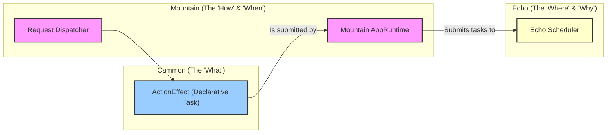

<table><tr>
<td colspan="1"> <h3 align="center"> <picture>
<source media="(prefers-color-scheme: dark)" srcset="https://PlayForm.Cloud/Dark/Image/GitHub/Land.svg">
<source media="(prefers-color-scheme: light)" srcset="https://PlayForm.Cloud/Image/GitHub/Land.svg">

</picture> </h3> </td> <td colspan="3" valign="top"> <h3 align="center"> Echo 📣
</h3> </td>
</tr></table>

---

# **Echo** 📣 Deep Dive & Architecture

This document provides a detailed technical overview of the **Echo** project for
developers. It explores the internal architecture, core components, and the
design patterns used to create a high-performance, structured concurrency
runtime for Rust applications, particularly for the `Mountain` backend in the
Land Code Editor.

---

## Core Architecture Principles

| Principle                  | Description                                                                                                                                                     | Key Components Involved                     |
| :------------------------- | :-------------------------------------------------------------------------------------------------------------------------------------------------------------- | :------------------------------------------ |
| **Performance**            | Use lock-free data structures (`crossbeam-deque`) and a work-stealing algorithm to achieve maximum throughput and low-latency task execution.                   | `queue::StealingQueue`, `scheduler::Worker` |
| **Structured Concurrency** | Manage all asynchronous operations within a supervised pool of workers, providing graceful startup and shutdown, unlike fire-and-forget `tokio::spawn`.         | `scheduler::Scheduler`, `SchedulerBuilder`  |
| **Decoupling**             | Separate the _submission_ of a task from its _execution_. An `AppRuntime` submits work, and the `Scheduler` handles how, when, and where it runs.               | `Scheduler::Submit`, `task::Task`           |
| **Resilience**             | The scheduler's design is inherently resilient; the failure of one task (if it panics) is contained within its `tokio` task and does not crash the worker pool. | `scheduler::Worker` (execution loop)        |
| **Composability**          | Provide a simple, generic `Submit` API that accepts any `Future<Output = ()>`, making it easy to integrate with any asynchronous Rust code.                     | `task::Task`, `Scheduler::Submit`           |
| **Prioritization**         | Allow tasks to be submitted with different priorities to ensure that latency-sensitive work is executed before background work.                                 | `task::Priority`                            |

---

## Deep Dive into `Echo`'s Components

### 1. The Task (`src/task/`)

- **Role:** The `Task` is the most fundamental unit of work in the Echo system.
  It's a simple, self-contained struct that the scheduler knows how to execute.
- **`Task.rs`:** Defines `pub struct Task`, which contains:
    - `Future: Pin<Box<dyn Future<Output = ()> + Send>>`: The actual
      asynchronous operation to be executed. By boxing the future, we can store
      different kinds of futures in the same queue (type erasure).
    - `Priority: Priority`: The priority level of the task.
- **`Priority.rs`:** Defines the `enum Priority` (`Low`, `Normal`, `High`). This
  allows the scheduler to make intelligent decisions about what to run next.

### 2. The Queue (`src/queue/`)

- **Role:** The `StealingQueue` is the high-performance heart of the scheduler.
  It's responsible for efficiently distributing `Task`s among all the worker
  threads.
- **`StealingQueue.rs`:**
    - **Data Structures:** It is built on `crossbeam_deque`. It contains:
        - An `Injector<Task>`: A lock-free, multi-producer queue where new tasks
          are initially pushed.
        - A `Vec<Worker<Task>>`: Each worker thread gets its own local,
          double-ended queue. This is a crucial performance optimization, as
          workers primarily operate on their own queue, avoiding contention.
        - A `Vec<Stealer<Task>>`: Handles that allow workers to steal tasks from
          each other's queues.
    - **Work-Stealing Logic (`StealForWorker`):** This is the core algorithm.
      When a worker requests a task, it follows a specific order to maximize
      efficiency:
        1.  **LIFO from Local Queue:** It first tries to `pop` from its own
            local queue. This is a Last-In, First-Out strategy, which is
            beneficial for cache locality.
        2.  **Steal from Global Queue:** If its local queue is empty, it tries
            to steal a batch of tasks from the global `Injector` queue.
        3.  **FIFO from Peer Queue:** If the global queue is also empty, it
            randomly selects another worker and tries to steal from the _bottom_
            of their queue. This is a First-In, First-Out strategy, which
            ensures that larger, longer-running tasks are stolen first, keeping
            all workers busy.

### 3. The Scheduler and Workers (`src/scheduler/`)

- **Role:** This module provides the main public API for the `Echo` library. It
  manages the lifecycle of the worker pool and orchestrates the entire system.
- **Component Breakdown:**
    - **`Worker.rs`:** Defines the `struct Worker`, which represents a single
      actor. Its `Run()` method contains an infinite loop that repeatedly calls
      `StealingQueue::StealForWorker` and `await`s the future of any task it
      finds.
    - **`SchedulerBuilder.rs`:** A fluent API for configuring the scheduler. It
      allows setting the number of worker threads and will be the place to add
      future configurations like named queues.
    - **`Scheduler.rs`:**
        - **`Start()`:** This method, called by the builder, creates the
          `StealingQueue`, spawns the configured number of `Worker`s onto
          `tokio` threads, and stores their `JoinHandle`s.
        - **`Submit()`:** The primary public method. It takes a future and a
          priority, wraps them in a `Task`, and pushes the task onto the global
          `Injector` queue for the workers to pick up.
        - **`Shutdown()`:** A graceful shutdown mechanism. It sets an
          `AtomicBool` flag that workers check, causing their loops to
          terminate. It then `await`s all the worker `JoinHandle`s to ensure a
          clean exit.

### End-to-End Workflow Example: Submitting an Effect

This demonstrates how `Mountain`'s `AppRuntime` uses `Echo` to run a
`Common::ActionEffect`:

1.  **Application Call (`Mountain`):** The `track` dispatcher creates an
    `ActionEffect`, for example, `FsHandler::ReadFile(...)`, and calls
    `runtime.Run(effect)`.
2.  **Runtime (`Mountain/src/runtime/AppRuntime.rs`):** The `Run` method
    receives the `ActionEffect`. a. It creates a `tokio::sync::oneshot` channel
    to get the result back. b. It creates a new `Future` that will: i. Call the
    `ActionEffect`'s `Apply` method with the required environment. ii. Take the
    `Result<Output, Error>` from the effect. iii. Send this result through the
    `oneshot` sender. c. It wraps this new `Future` in an `Echo::task::Task`
    struct with a priority.
3.  **Scheduler (`Echo/src/scheduler/Scheduler.rs`):** The `AppRuntime` calls
    `scheduler.Submit(task)`. The `Scheduler` pushes the `Task` onto its global
    `Injector` queue.
4.  **Worker (`Echo/src/scheduler/Worker.rs`):** An idle worker's `Run` loop
    successfully steals the task from the `Injector`.
5.  **Execution:** The worker `await`s the `Task.Future`. This executes the
    logic from step 2b, which in turn `await`s the original `ActionEffect`.
6.  **Result Propagation:** The `ActionEffect` completes. Its `Result` is sent
    through the `oneshot` channel.
7.  **Unwinding (`Mountain/src/runtime/AppRuntime.rs`):** The original `Run`
    method, which was `await`ing the `oneshot` receiver, wakes up with the
    result and returns it to the application.

---

## Project Structure Overview

The `Echo` repository is organized into a few core modules:

```
Echo/
└── Source/
    ├── lib.rs                   # Crate root, declares public modules.
    ├── scheduler/               # The main public API: Scheduler and SchedulerBuilder.
    ├── queue/                   # The internal, high-performance work-stealing queue.
    └── task/                    # The internal definition of a Task and its Priority.
```

---

## How `Echo` Fits into the `Land` Ecosystem

`Echo` is the foundational execution engine inside `Mountain`, ensuring that all
application logic runs efficiently and concurrently.


